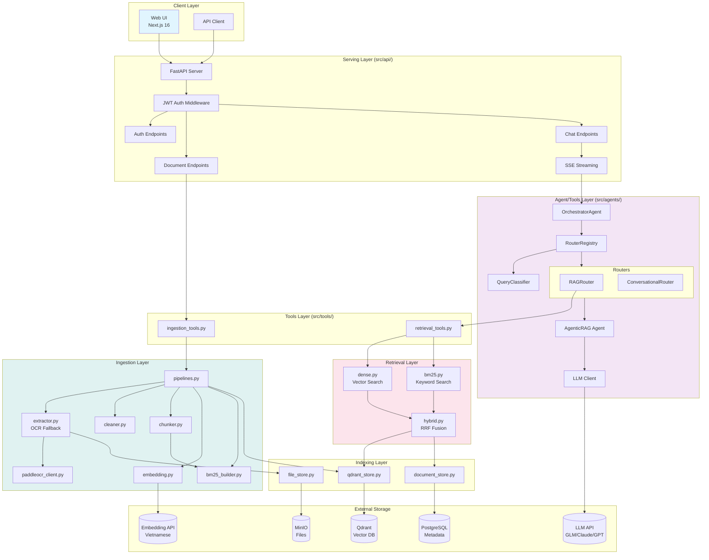
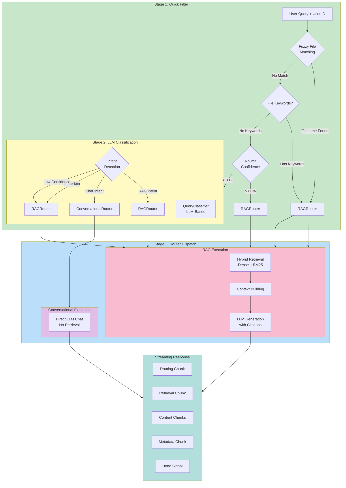
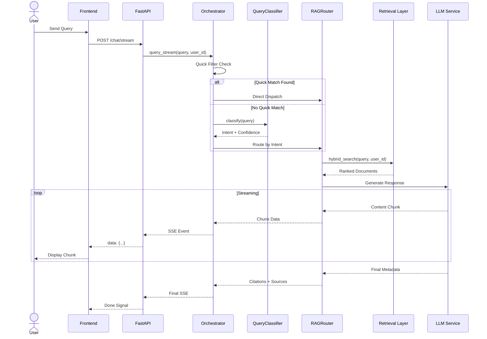
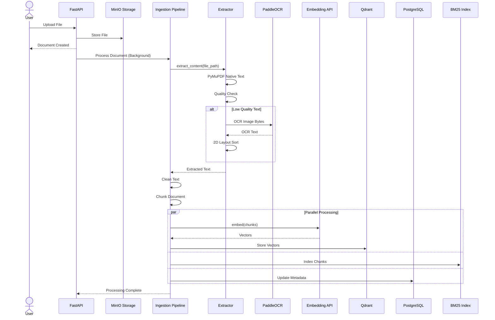

# CLAUDE.md - Development Guidelines

## Project Overview

**K.I.R.A Simplified** is a production-ready RAG (Retrieval-Augmented Generation) system with multi-stage query routing, hybrid retrieval, and intelligent OCR fallback. This document provides context for AI assistants working on this codebase.

## System Architecture

### Overall System Architecture



### Multi-Agent Routing Architecture



### Data Flow: Query Processing



### Data Flow: Document Ingestion



## Architecture Principles

### 4-Layer Architecture

The project follows a strict 4-layer architecture pattern:

1. **SERVING Layer** (`src/api/`)
   - FastAPI endpoints, authentication, request/response handling
   - SSE streaming for real-time responses
   - No business logic - only HTTP concerns

2. **AGENT/TOOLS Layer** (`src/agents/`, `src/tools/`)
   - Multi-stage routing: Quick Filter → LLM Classification → Router Dispatch
   - LangChain tools for agent integration
   - RAG and Conversational routers

3. **RETRIEVAL Layer** (`src/retrieval/`, `src/indexing/`)
   - Dense (Qdrant) + BM25 (keyword) search
   - RRF fusion for hybrid results
   - Per-user BM25 indexes

4. **INGESTION Layer** (`src/ingestion/`)
   - Extract → Clean → Chunk → Embed → Index pipeline
   - PaddleOCR fallback for low-quality PDFs
   - Per-user document processing

### Key Design Patterns

- **Per-User Isolation**: BM25 indexes, document filtering, and conversations are scoped to `user_id`
- **Async-First**: All I/O operations use async/await patterns
- **LangChain Tools**: Retrieval and ingestion operations use `@tool` decorators
- **SSE Streaming**: Chat responses stream structured chunks (routing, retrieval, content, metadata)
- **Soft Delete**: Conversations use soft delete pattern (`deleted_at` timestamp)

## Code Organization

### File Naming Conventions

- Use **kebab-case** for long, descriptive filenames
- Examples: `paddleocr_client.py`, `document_store.py`, `conversation_router.py`
- This makes files self-documenting for LLM tools (Grep, Glob, Search)

### Module Structure

```
src/
├── api/              # HTTP endpoints only
├── agents/           # Routing and LLM logic
│   └── routers/      # Router implementations
├── tools/            # LangChain tools
├── retrieval/        # Search algorithms
├── indexing/         # Database/Vector DB clients
├── ingestion/        # ETL pipeline
├── auth/             # JWT authentication
├── database/         # SQLAlchemy models
├── models/           # Pydantic schemas
├── constants/        # Application constants
└── main.py           # FastAPI entry point
```

## Key Features Implementation

### Multi-Stage Query Routing

Located in `src/agents/routers/registry.py`:

1. **Quick Filter**: Fast path for file-related queries
   - Fuzzy filename matching against user documents
   - File keyword detection (tài liệu, doc, pdf, etc.)
   - Router confidence checks

2. **LLM Classification**: For complex queries
   - Intent detection (rag vs conversational)
   - Confidence scoring
   - Fallback to default router if low confidence

3. **Router Dispatch**: Route to appropriate handler
   - `RAGRouter`: Document retrieval + LLM generation
   - `ConversationalRouter`: Direct LLM chat

### Intelligent OCR Fallback

Located in `src/ingestion/extractor.py`:

- **Low-quality detection**: Checks for excessive single-char words, low Vietnamese diacritics ratio
- **Hybrid extraction**: PyMuPDF native text → PaddleOCR for scanned pages
- **2D layout sorting**: OCR lines sorted in reading order (top-to-bottom, left-to-right)

### Per-User BM25 Index

Located in `src/ingestion/bm25_builder.py`:

- In-memory BM25 index per user
- Bulk add/remove operations
- Query with user-scoped search

### Hybrid Retrieval with RRF

Located in `src/retrieval/hybrid.py`:

- Parallel dense (Qdrant) and BM25 retrieval
- Reciprocal Rank Fusion (RRF) for result merging
- Configurable `k` parameter for RRF scoring

## Environment Configuration

### Configuration Hierarchy

1. **Static config** (`config/settings.yaml`):
   - Chunking parameters (size, overlap)
   - Retrieval parameters (k, rrf_k)
   - Qdrant collection settings

2. **Environment variables** (`.env`):
   - Database credentials
   - API keys (LLM, embedding)
   - OCR service URL
   - CORS origins

3. **Settings class** (`config/config.py`):
   - Pydantic-based validation
   - Fail-fast for production with default secrets

### Required Environment Variables

```bash
# Database
POSTGRES_HOST=localhost
POSTGRES_PORT=5433
POSTGRES_USER=kira
POSTGRES_PASSWORD=kira_secret
POSTGRES_DB=kira_dev

# JWT
JWT_SECRET_KEY=your-secret-key-here

# LLM
LLM_PROVIDER=glm
GLM_API_KEY=your-glm-api-key

# Embedding
EMBEDDING_BASE_URL=http://your-embedding-api:8888

# OCR (optional)
OCR_ENABLED=true
OCR_BASE_URL=http://paddleocr-service:8868
```

## API Response Patterns

### SSE Streaming Format

Chat streaming (`POST /api/v1/chat/stream`) yields structured chunks:

```json
// Routing decision
{"type": "routing", "data": {"router": "RAGRouter", "intent": "rag", "confidence": 0.95}}

// Retrieval progress
{"type": "retrieval", "data": {"iteration": 1, "strategy": "hybrid", "docs_retrieved": 5}}

// Content chunks
{"type": "content", "data": {"text": "Response chunk..."}}

// Final metadata
{"type": "metadata", "data": {"status": "success", "citations": [...], "conversation_id": "..."}}

// Done signal
{"type": "done"}
```

### Standard Response Format

Non-streaming responses follow this structure:

```json
{
  "content": "Answer text...",
  "citations": [{"filename": "doc.pdf", "page": 1, "text": "..."}],
  "conversation_id": "uuid",
  "message_id": "uuid",
  "metadata": {"router": "RAGRouter", "agent": "rag", "latency_ms": 1234}
}
```

## Development Guidelines

### When Adding New Features

1. **New Router?** Add to `src/agents/routers/`:
   - Inherit from `BaseRouter`
   - Implement `can_handle()`, `handle()`, `handle_stream()`
   - Register in `RouterRegistry`

2. **New Tool?** Add to `src/tools/`:
   - Use `@tool` decorator from LangChain
   - Include docstring for tool description
   - Export from `__init__.py`

3. **New Endpoint?** Add to `src/api/`:
   - Use FastAPI router pattern
   - Add JWT auth via `Depends(get_current_user)`
   - Use async/await for I/O

4. **Database Change?** Update:
   - `src/database/models.py` (SQLAlchemy model)
   - `src/models/*.py` (Pydantic schemas)
   - Create Alembic migration

### Error Handling

- Use `src/constants/` for error messages
- Return structured errors in API responses
- Log errors with appropriate level
- Use soft delete for data that shouldn't be permanently removed

### Testing

- Tests located in `tests/`
- Use pytest with async support
- Test with real database (docker-compose services)
- Mock external API calls (LLM, embedding, OCR)

## Common Tasks

### Adding a New LLM Provider

1. Add configuration to `config/config.py`
2. Create client in `src/agents/llm.py`
3. Update `LLM_PROVIDER` in `.env`

### Adding a New Router

1. Create file in `src/agents/routers/`
2. Implement `BaseRouter` interface
3. Register in `orchestrator.py`

### Modifying Retrieval Strategy

1. Update `config/settings.yaml` for parameters
2. Modify retrieval logic in `src/retrieval/`
3. Test with different query types

## Vietnamese Language Support

The system is optimized for Vietnamese:

- **Embeddings**: BAAI/bge-m3 or Vietnamese-embedding-v2
- **OCR**: PaddleOCR with Vietnamese language model
- **LLM**: GLM-4.5 (Zhipu AI) with strong Vietnamese support
- **Text Cleaning**: Preserves Vietnamese diacritics during normalization

## Frontend Notes

The frontend is a **separate Next.js 16 application**:

- Located in `frontend/`
- Uses shadcn/ui components
- Zustand for state management
- TanStack Query for API calls
- i18n support (Vietnamese/English)
- **Port**: 3001 (different from default 3000)

## Deployment

### Infrastructure

All infrastructure runs in Docker Compose:

- PostgreSQL 16 with pgvector
- Qdrant vector database
- MinIO object storage

### Production Checklist

- Set `APP_ENV=production`
- Use strong `JWT_SECRET_KEY`
- Configure CORS origins properly
- Enable `AUTH_ENABLED=true`
- Set up PaddleOCR service (if using OCR)
- Configure external LLM and embedding APIs

## Troubleshooting

### Common Issues

1. **BM25 index empty**: Check BM25 builder initialization, ensure documents processed
2. **OCR not working**: Verify `OCR_BASE_URL` and service health
3. **No retrieval results**: Check Qdrant collection, verify embeddings generated
4. **Auth errors**: Verify JWT token, check `AUTH_ENABLED` setting

### Debug Mode

Set `DEBUG=true` in `.env` for detailed logging.

## Resources

- **Architecture**: 4-layer pattern from agentic-rag
- **Hybrid Retrieval**: RRF (Reciprocal Rank Fusion) algorithm
- **OCR**: PaddleOCR HTTP API
- **Vector DB**: Qdrant documentation
- **Frontend**: Next.js 16 + shadcn/ui

---

*This document is maintained alongside the codebase. Update when architecture or patterns change.*
