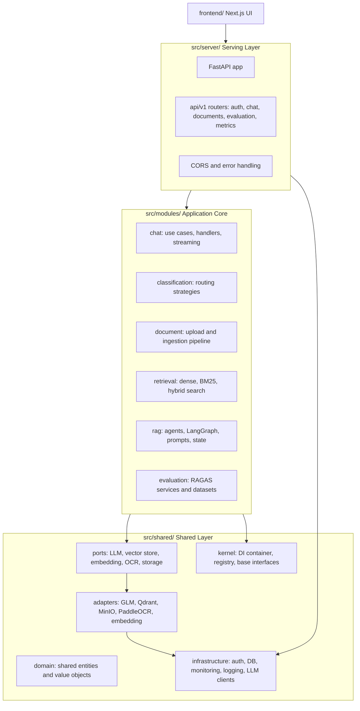

# CLAUDE.md - AI Assistant Guide

This file gives AI coding assistants the working context for the K.I.R.A Simplified codebase.

## Project Snapshot

K.I.R.A Simplified is a full-stack Retrieval-Augmented Generation application:

- **Backend**: FastAPI on Python 3.12
- **Frontend**: Next.js 16, React 19, TypeScript, Tailwind CSS
- **Storage**: PostgreSQL, Qdrant, MinIO
- **Retrieval**: Dense vector search, BM25 keyword search, RRF hybrid fusion
- **RAG**: Conversational and document-grounded chat handlers, optional multi-agent/LangGraph paths
- **Evaluation**: RAGAS service, golden datasets, batch evaluation
- **Auth**: JWT with httpOnly cookie support
- **Architecture**: Hexagonal Modular Monolith

**Language Policy**: Use Vietnamese for user-facing explanations in chat. Keep code, identifiers, comments, and technical documentation in English unless explicitly asked otherwise.

## Mandatory Coding Rules ⚠️

**CRITICAL**: All code MUST follow these rules. Non-compliance will be rejected.

### 1. Clean Architecture Rules (MANDATORY)

```python
# ✅ CORRECT: Clean Architecture compliance
# Inside (Application Core) - src/modules/
from src.shared.ports.llm import LLMClient  # Depend on port (ABC), not concretion

class ChatUseCase:
    """Application use case - orchestrates domain logic."""
    
    def __init__(self, llm_client: LLMClient):  # Inject port, not concretion
        self.llm_client = llm_client
    
    async def execute(self, query: str, user_id: str) -> ChatResult:
        # Use case orchestrates, doesn't implement business rules
        classification = await self.classifier.classify(query, user_id)
        handler = self.handler_factory.create(classification.intent)
        return await handler.handle(query, user_id, classification)

# ❌ WRONG: Violates Clean Architecture
from src.shared.adapters.llm.glm import GLMClient  # Depends on concretion!
from sqlalchemy import select  # Infrastructure leak into application!

class ChatService:
    def __init__(self):
        self.glm = GLMClient()  # Constructs dependency directly!
    
    def handle_query(self, query, user_id):
        # Mixes concerns - classification + execution + persistence
        if "contract" in query:
            results = self.db.query(Document).filter(...).all()  # Direct DB access!
        return self.glm.generate(query)
```

**Rules:**
1. **Dependency Rule**: Dependencies point inward (toward domain). Never outward.
2. **Port-Adapter Pattern**: Use `src/shared/ports/` interfaces, not `src/shared/adapters/` implementations
3. **Module Boundaries**: 
   - `src/server/` - HTTP only, no business logic
   - `src/modules/<context>/application/` - Use cases only (orchestration)
   - `src/modules/<context>/domain/` - Business logic only
   - `src/modules/<context>/infrastructure/` - Module-specific persistence only
4. **No Direct Infrastructure**: Application code NEVER imports from:
   - `src/shared/adapters/` (use ports instead)
   - `src/shared/infrastructure/persistence/` (use repositories instead)
   - `sqlalchemy` directly (use repositories instead)

### 2. PEP8 Compliance (MANDATORY)

```python
# ✅ CORRECT: PEP8 compliant
from typing import Any

class UserService:
    """Service for user operations."""
    
    async def get_user(self, user_id: str) -> User | None:
        """Get user by ID.
        
        Args:
            user_id: User identifier
            
        Returns:
            User object or None if not found
        """
        if not user_id:
            raise ValueError("user_id cannot be empty")
        
        return await self.repository.get_by_id(user_id)

# ❌ WRONG: PEP8 violations
class userService:  # Wrong: should be PascalCase
    def getuser(self, userId):  # Wrong: snake_case, missing hints, no docstring
        pass  # Wrong: no implementation
```

**Rules:**
1. **Naming**: 
   - Classes: `PascalCase`
   - Functions/Variables: `snake_case`
   - Constants: `UPPER_SNAKE_CASE`
   - Modules: `snake_case.py`
2. **Type Hints**: Required on all public functions/methods
3. **Docstrings**: Required on all classes and public methods
4. **Line Length**: Max 100 characters (soft limit), 120 (hard limit)
5. **Imports**: 
   - Absolute imports from `src...`
   - Group: stdlib → third-party → local
   - No `from module import *`

### 3. Auto-Enforcement

**Before committing:**
```bash
# Run PEP8 check
ruff check src/ tests/ --fix

# Run PEP8 format
ruff format src/ tests/

# Run type check
mypy src/
```

**If tools report violations:**
1. Fix all PEP8 errors
2. Fix all type hints
3. Re-run checks until clean
4. Only then commit

## Current Architecture

The backend is a **hexagonal modular monolith** with clear separation between application core and infrastructure.



**Key Principles:**
- **Inside (Application Core)**: `src/modules/` - Business logic, use cases, domain services
- **Outside (Infrastructure)**: `src/shared/adapters/`, `src/shared/infrastructure/` - External services, technical concerns
- **Ports**: `src/shared/ports/` - Interfaces defined by core, implemented by infrastructure
- **DI Container**: `src/shared/kernel/di/` - Service wiring and lifecycle management

## Important Entry Points

### Backend
- **Backend app**: `src/server/main.py`
- **Runtime settings**: `src/config/config.py` (Pydantic Settings with env vars)
- **Static settings**: `src/config/settings.yaml` (retrieval, chunking, feature flags)
- **Database session**: `src/shared/infrastructure/persistence/database/session.py`
- **Database models**: `src/shared/infrastructure/persistence/database/models.py`

### API Endpoints
- **Auth**: `src/server/api/v1/auth/endpoints.py`
- **Chat**: `src/server/api/v1/chat/chat_endpoints.py`
- **Documents**: `src/server/api/v1/documents/document_endpoints.py`
- **Evaluation**: `src/server/api/v1/evaluation/evaluation_endpoints.py`
- **Metrics**: `src/server/api/v1/metrics/metrics_endpoints.py`

### Frontend
- **App routes**: `frontend/src/app/`
- **API client/hooks**: `frontend/src/lib/`

**Important**: Do not add new imports against legacy top-level structures. The current code layout follows the hexagonal modular monolith pattern shown above.

## Module Structure

Each module follows this structure:

```text
src/modules/<context>/
├── api/              # Request/Response DTOs owned by the module
├── application/      # Use cases and application DTOs
├── domain/           # Business logic, strategies, services, prompts, state
└── infrastructure/   # Persistence, external integrations, module-specific clients
```

**Module Boundaries Guidelines:**

- **Keep HTTP details in** `src/server/api/v1/...`
- **Keep orchestration/use-case code in** `application/`
- **Keep domain decisions in** `domain/`
- **Keep concrete external integration in** `infrastructure/` or `src/shared/adapters/`
- **Put cross-cutting contracts in** `src/shared/ports/`
- **Register concrete services through** `src/shared/kernel/di/` instead of constructing them throughout the codebase

### Existing Modules

1. **Chat** (`src/modules/chat/`)
   - Chat use case orchestration
   - Query classification integration
   - Handler selection and execution
   - SSE streaming response formatting
   - Conversation and message persistence

2. **Classification** (`src/modules/classification/`)
   - Query intent classification (RAG vs Conversational)
   - Strategy pattern for pluggable classifiers
   - Fallback chain: Keyword → Cached → LLM
   - LRU caching for performance

3. **Document** (`src/modules/document/`)
   - Document upload and validation
   - Background ingestion pipeline
   - Text extraction and cleaning
   - Document status management

4. **Retrieval** (`src/modules/retrieval/`)
   - Dense vector retrieval (Qdrant)
   - BM25 keyword retrieval
   - Hybrid search with RRF fusion
   - Per-user result filtering

5. **RAG** (`src/modules/rag/`)
   - Agentic RAG with LangGraph
   - Multi-agent orchestration
   - Thinking visualization
   - Citation verification

6. **Evaluation** (`src/modules/evaluation/`)
   - RAGAS-based evaluation
   - Golden dataset management
   - Batch evaluation

## Shared Layer

```text
src/shared/
├── ports/              # External system interfaces (ABC)
│   ├── llm.py
│   ├── vector_store.py
│   ├── embedding.py
│   ├── ocr.py
│   └── storage.py
├── adapters/           # External system implementations
│   ├── llm/
│   ├── vector/
│   ├── embedding/
│   ├── ocr/
│   └── storage/
├── infrastructure/     # Technical concerns
│   ├── auth/
│   ├── llm/
│   ├── monitoring/
│   ├── persistence/
│   └── logging/
├── kernel/             # DI and service registry
│   ├── base/
│   ├── di/
│   └── utils/
└── domain/             # Shared entities
    ├── entities/
    └── value_objects/
```

**Shared Layer Guidelines:**
- **Ports**: Define interfaces for external services (LLM, vector store, etc.)
- **Adapters**: Implement port interfaces (GLM, Qdrant, MinIO, etc.)
- **Infrastructure**: Handle technical concerns (auth, DB, monitoring, logging)
- **Kernel**: DI container and service registry
- **Domain**: Shared entities and value objects

## Runtime Behavior

### Backend Startup

Backend startup in `src/server/main.py` does the following:

1. Initializes database connections
2. Ensures the Qdrant collection exists
3. Preloads the embedding model/client path
4. Initializes retrieval, ingestion, and reranking tools
5. Creates an LLM client for reranking/hybrid search support
6. Registers routers and health checks

### Chat Streaming Flow

```text
/api/v1/chat/stream
  → JWT authentication
  → Chat module (chat.py)
  → Classification module
    - CompositeClassifier tries strategies
    - Returns ClassificationResult (intent + confidence)
  → Handler Selection (via DI Container)
    - RAGHandler for RAG intent
    - ConversationalHandler for chat intent
  → Handler Execution
    - If RAG: Retrieval → Context Building → LLM Generation
    - If Conversational: Direct LLM chat
  → SSE Streaming
    - routing chunk
    - retrieval chunk
    - thinking chunk (if enabled)
    - content chunks
    - citations chunk
    - done signal
  → Persistence
    - Save user message
    - Save assistant message
```

### Document Upload Flow

```text
/api/v1/documents/upload
  → MinIO upload (original file)
  → PostgreSQL document row creation
  → Background ingestion task
    → Extraction (PyMuPDF → PaddleOCR fallback)
    → Cleaning (preserve Vietnamese diacritics)
    → Chunking (2048 tokens, 256 overlap)
    → Embedding (via API, 1024-dim vectors)
    → Indexing (Qdrant upsert + BM25 update)
  → Document status update (complete)
```

### Retrieval Flow

```text
Query + User ID
  → Embedding API (1024-dim vector)
  → Parallel Retrieval
    ├─→ Dense Retrieval (Qdrant)
    │   - Vector similarity search
    │   - Filter by user_id
    │   - Return top-k results
    │
    └─→ BM25 Retrieval
      - Keyword search
      - Per-user index
      - Return top-k results
  → RRF Fusion
    - Combine results from both retrievers
    - Score-based merging
    - Return top-k fused results
  → Reranking (Optional)
    - LLM-based reranking
    - Filter low-score results
  → Citation Generation
    - Extract relevant snippets
    - Verify citation grounding
    - Return final citations
```

## Frontend Shape

The frontend lives under `frontend/` and uses the App Router:

**Pages:**
- `frontend/src/app/login/page.tsx`
- `frontend/src/app/register/page.tsx`
- `frontend/src/app/chat/page.tsx`
- `frontend/src/app/conversation/[id]/page.tsx`
- `frontend/src/app/uploads/page.tsx`

**Reusable Components:**
- `frontend/src/components/ui/` (shadcn/ui components)
- `frontend/src/components/auth/`
- `frontend/src/components/chat/`
- `frontend/src/components/documents/`
- `frontend/src/components/sidebar/`

**Client Code and State:**
- API client: `frontend/src/lib/api/simple-client.ts`
- Chat hooks: `frontend/src/lib/hooks/use-simple-chat.ts`, `use-streaming-chat.ts`
- Stores: `frontend/src/lib/stores/` (auth, conversation, sources)
- Streaming: `frontend/src/lib/streaming/` (parser, state)
- Locales: `frontend/src/lib/locales/` and `frontend/src/locales/`

**Frontend Guidelines:**
- Follow existing component conventions
- Keep operational app screens direct and usable
- Do not turn app pages into marketing landing pages
- Use existing UI components from `components/ui/`

## Configuration

### Runtime Settings (src/config/config.py)

Environment-based configuration via Pydantic Settings:

**Required or High-Impact Variables:**
- `JWT_SECRET_KEY` is **required**
- `APP_ENV=production` rejects known default JWT secrets
- `POSTGRES_*` controls async SQLAlchemy connection
- `QDRANT_*` controls vector store connection
- `MINIO_*` controls object storage
- `LLM_PROVIDER`, `GLM_API_KEY`, `GEMINI_API_KEY`, or `OPENAI_API_KEY` controls generation/reranking
- `EMBEDDING_BASE_URL`, `EMBEDDING_MODEL`, and `EMBEDDING_DIM` control embeddings

### Static Settings (src/config/settings.yaml)

Static defaults for:
- Retrieval (top-k, RRF constant, score threshold)
- Reranking (mode, limits)
- Citations (limits, verification, snippet length)
- Chunking (size, overlap)
- Qdrant (collection, vector dimension)
- Semantic routing (threshold)
- Feature flags (classification, handlers, semantic router, LLMlite)
- RAGAS evaluation (enabled flag, metrics, timeout, cache)

## Development Commands

### Backend

```bash
# Install dependencies
pip install -e ".[dev]"

# Run backend
python -m src.server.main

# Run tests
pytest tests/ -v

# Lint and format
ruff check src/ tests/
ruff format src/ tests/
```

### Frontend

```bash
cd frontend

# Install dependencies
npm install --legacy-peer-deps

# Run dev server
npm run dev

# Lint
npm run lint

# Build
npm run build

# Test
npm test
```

### Infrastructure

```bash
# Start all services
docker compose up -d

# Check status
docker compose ps

# View logs
docker compose logs -f

# Stop all services
docker compose down
```

### Makefile Shortcuts

```bash
make help              # Show available commands
make infra             # Start infrastructure
make dev-backend       # Run backend using .venv
make dev-frontend      # Run frontend
make test-backend      # Run backend tests
make test-frontend     # Run frontend tests
make lint              # Run backend and frontend lint
make format            # Format backend and run frontend lint fix
```

**Note**: `make dev-backend` assumes `.venv/bin/activate` exists. If not, run backend commands directly or create a virtual environment first.

## Testing Guidance

### Test Structure

Prefer focused tests near the changed behavior:

- **DI and feature flags**: `tests/unit/di/`
- **Classification**: `tests/unit/classification/`
- **Handlers**: `tests/unit/handlers/`
- **Agents/RAG**: `tests/unit/agents/`, `tests/agentic_rag/`
- **Retrieval**: `tests/retrieval/`
- **Evaluation**: `tests/evaluation/`, `tests/integration/test_evaluation_api.py`
- **API/Integration**: `tests/integration/`
- **Tools**: `tests/tools/`

### Quick Checks

For low-infrastructure checks, start with:

```bash
pytest tests/unit tests/interfaces -v
```

Run broader tests when changing shared contracts, dependency injection, persistence models, auth, retrieval, or streaming.

## Coding Standards

### Python

- **Python 3.12 syntax** is allowed
- **PEP 8** with the repo's Ruff settings
- **Absolute imports** from `src...`
- **Type hints** on new public functions and methods
- **Async APIs** consistently when working with database, HTTP, or streaming paths
- **Line length** near 100 characters where practical
- **No silent exception swallowing**; log enough context and preserve HTTP-safe error behavior
- **No new global mutable state** unless it matches an existing singleton pattern

### Frontend

- **TypeScript** should stay typed at component and hook boundaries
- **Existing UI components** under `frontend/src/components/ui/`
- **Existing stores/hooks** before adding new state systems
- **Streaming parsing changes** compatible with current SSE event shapes
- **i18n patterns** when adding user-facing strings

### Documentation

- **README.md**: User-facing setup, architecture, or workflow changes
- **CLAUDE.md**: Assistant/developer guidance, entrypoints, boundaries, or major conventions
- **docs/**: Deep technical documentation

## Safety Notes For AI Agents

- The repo may have user changes. Check `git status --short` before editing and do not revert unrelated work.
- Use `rg`/`rg --files` for search.
- Use `apply_patch` for manual edits.
- **Do not run destructive commands** such as `git reset --hard`, `git checkout --`, or broad deletes unless explicitly requested.
- **Be careful with `make db-reset`**; it deletes local database volumes after confirmation.
- **Do not add dependencies** unless the existing stack cannot reasonably solve the problem.
- If a command fails due to missing external services, report the service requirement instead of masking the failure.

## Common Pitfalls

- **Use `src/server/main.py`** for the FastAPI app. The legacy root-level shim has been removed.
- Some endpoint filenames were historically hyphenated; current files use underscore names.
- Auth uses cookies in the primary flow, but some refresh endpoints support body-token compatibility.
- RAGAS evaluation endpoints return 503 when `ragas_evaluation_enabled` is false.
- **Frontend dev port is `3001`**, not `3000`.
- **Backend dev port is `8006`**.
- Qdrant vector dimension must match the embedding dimension, currently `1024` in static settings.
- **Module boundaries**: Follow the hexagonal architecture pattern - don't mix concerns across layers.

## Architecture Quick Reference

### When Adding New Features

1. **Identify the module**: Does this belong in chat, document, retrieval, etc.?
2. **Follow module structure**: api/application/domain/infrastructure
3. **Define ports first**: If external service needed, add interface to `src/shared/ports/`
4. **Implement adapters**: Add concrete implementation to `src/shared/adapters/`
5. **Wire through DI**: Register services in `src/shared/kernel/di/`
6. **Keep HTTP separate**: API details in `src/server/api/v1/`

### When Fixing Bugs

1. **Locate the module**: Which module owns this functionality?
2. **Check the layer**: Is this in domain (business logic) or infrastructure (technical)?
3. **Follow the flow**: Use the request flow diagrams to understand the execution path
4. **Test boundaries**: Ensure fixes don't violate module boundaries

### When Refactoring

1. **Respect hexagonal boundaries**: Inside (domain) vs Outside (infrastructure)
2. **Extract to modules**: If code is shared, consider moving to appropriate module
3. **Use ports/adapters**: For external service integration
4. **Leverage DI**: Wire services through container, don't construct directly

---

*Last Updated: 2026-06-12*
*Architecture: Hexagonal Modular Monolith*
*Python: 3.12 | Next.js: 16 | React: 19*
