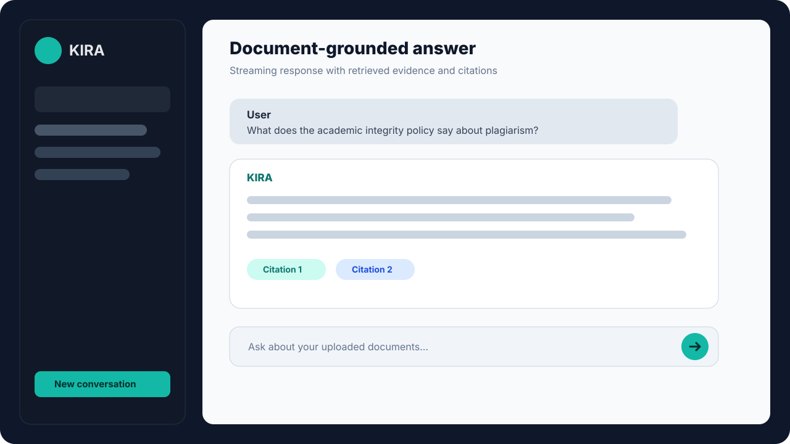
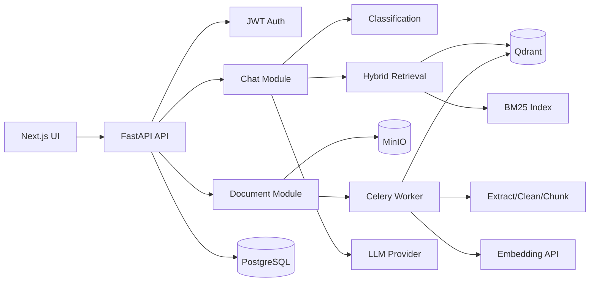
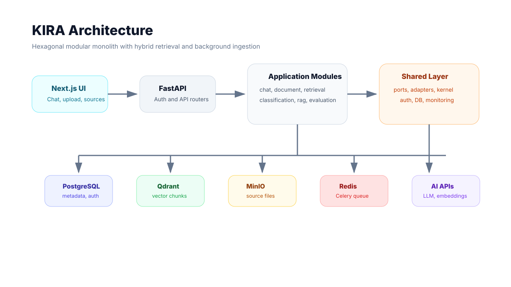
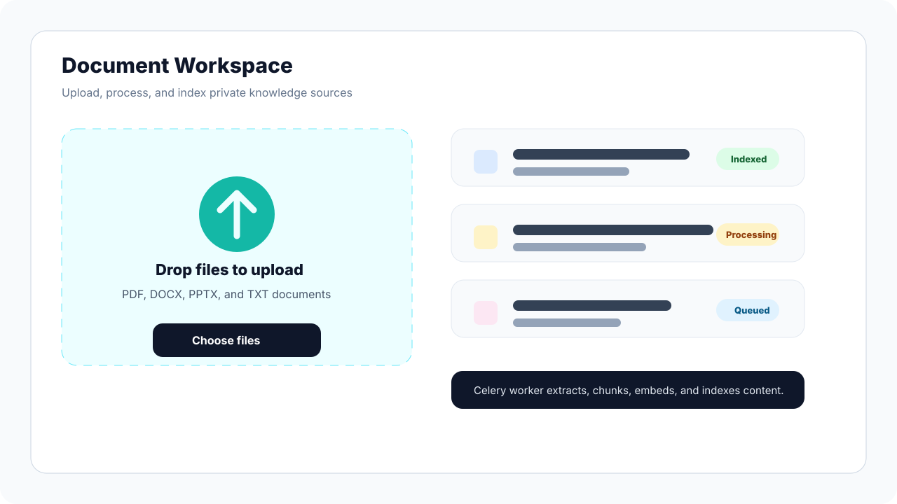

# KIRA

KIRA is a full-stack Retrieval-Augmented Generation application for private document question answering, citation-aware chat, and retrieval quality evaluation. The project combines a FastAPI modular monolith, a Next.js chat interface, hybrid search, background document ingestion, and LLM-powered answer generation.

> Knowledge-based Intelligent Retrieval Assistant for Vietnamese-first document workflows.



## Highlights

- Authenticated multi-user workspace with JWT and httpOnly cookies
- Document upload, storage, processing, chunking, and indexing
- PDF/DOCX/PPTX/TXT extraction with OCR/VLM-oriented processing options
- Dense vector search with Qdrant and keyword search with BM25
- Hybrid retrieval with Reciprocal Rank Fusion and optional LLM reranking
- Streaming chat over Server-Sent Events with routing, retrieval, thinking, content, and citation events
- Conversation persistence, soft delete, source panels, and citation previews
- Celery + Redis background worker for document processing
- DeepEval/RAG evaluation endpoints, datasets, and CLI helpers
- Hexagonal modular monolith architecture with ports, adapters, and module boundaries

## Product Preview

Add real screenshots after running the app locally. Recommended image files:

| Screenshot | Suggested path | What to capture |
| --- | --- | --- |
| Chat with citations | `docs/assets/kira-chat.png` or `.svg` | Conversation page with a document-grounded answer and source citations open |
| Document upload | `docs/assets/kira-upload.png` or `.svg` | Upload page after a PDF/DOCX file has been processed |
| Source panel | `docs/assets/kira-sources.png` | Citation/source panel showing matched chunks |
| Architecture diagram | `docs/assets/kira-architecture.png` or `.svg` | Diagram exported from Mermaid/Figma/FigJam |

Suggested commands after creating the images:

```bash
mkdir -p docs/assets
# Save screenshots with the filenames above, then commit them with the docs.
```

You can also generate the architecture image from this Mermaid sketch:







## Architecture

The backend follows a hexagonal modular monolith. Business behavior lives in modules, external systems are accessed through ports/adapters, and HTTP concerns stay at the server edge.

```text
Frontend (Next.js 16 / React 19)
        |
        v
FastAPI serving layer (src/server/)
        |
        v
Application modules (src/modules/)
        |
        v
Shared ports, kernel, and domain contracts (src/shared/)
        |
        v
Adapters and infrastructure (PostgreSQL, Qdrant, MinIO, Redis, LLM, OCR, Embedding)
```

Main modules:

- `chat`: chat orchestration, SSE streaming, handlers, conversation persistence
- `classification`: intent routing with keyword, cache, and LLM strategies
- `document`: upload, storage, deletion, download, chunks, ingestion pipeline
- `retrieval`: dense retrieval, BM25, hybrid search, reranking support
- `rag`: LangGraph/agentic RAG orchestration and generation flow
- `evaluation`: DeepEval/RAG evaluation services, datasets, and CLI runner

## Repository Layout

```text
kira-simple/
├── src/
│   ├── server/                  # FastAPI app, routers, middleware
│   ├── modules/                 # chat, classification, document, retrieval, rag, evaluation
│   ├── shared/                  # ports, adapters, infrastructure, kernel, shared domain
│   ├── config/                  # Pydantic env settings and static YAML settings
│   ├── tools/                   # ingestion and retrieval initializers/tools
│   └── worker/                  # Celery app and document processing tasks
├── frontend/                    # Next.js 16 frontend
├── docs/                        # architecture, deployment, pipeline, roadmap docs
├── migrations/                  # SQL init migrations for local PostgreSQL
├── scripts/                     # ingestion, crawling, evaluation, debugging utilities
├── tests/                       # backend tests
├── docker-compose.yml           # PostgreSQL, Qdrant, MinIO, Redis
├── Makefile                     # common local commands
├── CLAUDE.md                    # AI/developer operating guide
└── pyproject.toml               # Python package and tooling config
```

## Tech Stack

| Layer | Technology |
| --- | --- |
| Backend | Python 3.12, FastAPI, SQLAlchemy asyncio, Pydantic Settings |
| Frontend | Next.js 16, React 19, TypeScript, Tailwind CSS, Radix UI/shadcn-style components |
| Storage | PostgreSQL 16 + pgvector, Qdrant, MinIO |
| Background jobs | Celery, Redis |
| Retrieval | Dense vector search, BM25, RRF fusion, optional LLM reranking |
| LLM/AI | GLM/Z.ai by default, Gemini/OpenAI-compatible/Ollama options, external embedding API |
| Quality | Pytest, Ruff, MyPy, ESLint, Vitest, DeepEval |

## Prerequisites

- Python 3.12+
- Node.js 20+
- Docker and Docker Compose
- An LLM provider key or compatible local/provider endpoint
- An embedding API compatible with the configured `EMBEDDING_BASE_URL`

## Quick Start

### 1. Start infrastructure

```bash
docker compose up -d
```

This starts:

- PostgreSQL on `localhost:5433`
- Qdrant on `localhost:6333`
- MinIO API on `localhost:9000` and console on `localhost:9001`
- Redis on `localhost:6379`

### 2. Configure environment

Create `.env` in the project root:

```bash
JWT_SECRET_KEY=$(openssl rand -hex 32)

POSTGRES_HOST=localhost
POSTGRES_PORT=5433
POSTGRES_USER=kira
POSTGRES_PASSWORD=kira_secret
POSTGRES_DB=kira_dev

QDRANT_HOST=localhost
QDRANT_PORT=6333

MINIO_ENDPOINT=localhost:9000
MINIO_ACCESS_KEY=kira_minio
MINIO_SECRET_KEY=kira_minio_secret
MINIO_BUCKET=kira-documents
MINIO_SECURE=false

REDIS_HOST=localhost
REDIS_PORT=6379
CELERY_BROKER_URL=redis://localhost:6379/0
CELERY_RESULT_BACKEND=redis://localhost:6379/1

LLM_PROVIDER=glm
GLM_API_KEY=your-glm-api-key
GLM_MODEL=glm-4.5

EMBEDDING_BASE_URL=http://localhost:8001
EMBEDDING_MODEL=vietnamese-embedding-v2
EMBEDDING_DIM=1024

CORS_ORIGINS=http://localhost:3001,http://localhost:3000,http://localhost:8006
```

### 3. Install and run backend

```bash
pip install -e ".[dev]"
python -m src.server.main
```

Backend URL: http://localhost:8006

API docs: http://localhost:8006/docs

At startup, the backend writes a Loguru dependency report for PostgreSQL, Qdrant,
MinIO, Redis, Celery workers, the embedding API, the configured LLM, PaddleOCR, and
Docling. `DOWN` or `SKIP` entries identify unavailable or intentionally disabled
optional services; PostgreSQL remains required for startup.

### 4. Run document worker

Document upload enqueues a Celery task. Keep a worker running during local development:

```bash
celery -A src.worker.celery_app.celery_app worker --loglevel=info --concurrency=2
```

### 5. Install and run frontend

```bash
cd frontend
npm install --legacy-peer-deps
npm run dev
```

Frontend URL: http://localhost:3001

### 6. Health checks

```bash
curl http://localhost:8006/health
curl http://localhost:8006/health/ready
curl http://localhost:8006/health/live
```

## Common Commands

```bash
make help              # Show available commands
make infra             # Start PostgreSQL, Qdrant, MinIO, Redis
make dev-backend       # Run backend through .venv
make dev-worker        # Run Celery document worker through .venv
make dev-frontend      # Run frontend
make test-backend      # Run backend tests
make test-frontend     # Run frontend tests
make lint              # Run backend and frontend lint
make format            # Format backend and run frontend lint fix
make eval-rag USER_ID=<uuid> DATASET=<path>
```

Direct commands:

```bash
pytest tests/ -v
ruff check src/ tests/
ruff format src/ tests/

cd frontend
npm run lint
npm run build
npm test
```

## API Overview

All application endpoints are mounted under `/api/v1`.

### Authentication

- `POST /api/v1/auth/register`
- `POST /api/v1/auth/login`
- `POST /api/v1/auth/logout`
- `POST /api/v1/auth/refresh`
- `POST /api/v1/auth/refresh-with-token`
- `GET /api/v1/auth/me`

### Chat

- `POST /api/v1/chat/completions`
- `POST /api/v1/chat/stream`
- `GET /api/v1/chat/conversations`
- `POST /api/v1/chat/conversations`
- `GET /api/v1/chat/conversations/{conversation_id}`
- `DELETE /api/v1/chat/conversations/{conversation_id}`

### Documents

- `POST /api/v1/documents/upload`
- `GET /api/v1/documents`
- `GET /api/v1/documents/{document_id}`
- `DELETE /api/v1/documents/{document_id}`
- `POST /api/v1/documents/{document_id}/process`
- `GET /api/v1/documents/{document_id}/download`
- `GET /api/v1/documents/{document_id}/chunks`

### Evaluation

- `POST /api/v1/evaluation/evaluate`
- `POST /api/v1/evaluation/evaluate/batch`
- `GET /api/v1/evaluation/datasets`
- `POST /api/v1/evaluation/datasets`

### Metrics

- `GET /api/v1/metrics/routing/summary`
- `GET /api/v1/metrics/routing/analysis`
- `GET /api/v1/metrics/routing/problematic`
- `GET /api/v1/metrics/routing/hourly`
- `POST /api/v1/metrics/routing/clear`

## Configuration

Runtime environment variables are defined in `src/config/config.py`. Static retrieval, chunking, reranking, citation, and feature-flag defaults are defined in `src/config/settings.yaml`.

Important settings:

- `JWT_SECRET_KEY` is required.
- `APP_ENV=production` rejects known default JWT secrets.
- `QDRANT_VECTOR_DIM`, `EMBEDDING_DIM`, and `qdrant.vector_dim` must match.
- Frontend development uses port `3001`.
- Backend development uses port `8006`.
- Upload processing needs Redis and a running Celery worker.

## Documentation

- [System Architecture](docs/system-architecture.md)
- [Project Overview](docs/project-overview.md)
- [Deployment Guide](docs/deployment-guide.md)
- [Document Processing Pipeline](docs/high-accuracy-document-processing-pipeline.md)
- [Docling Document Processing](docs/docling-document-processing.md)
- [Project Roadmap](docs/project-roadmap.md)
- [Code Standards](docs/code-standards.md)
- [AI Assistant Guide](CLAUDE.md)

## Development Notes

- Keep HTTP behavior in `src/server/` or module `api/` files.
- Keep orchestration in `application/`.
- Keep domain decisions in `domain/`.
- Put concrete integrations in `infrastructure/` or `src/shared/adapters/`.
- Use contracts from `src/shared/ports/` when adding external service boundaries.
- Do not bypass per-user filtering in document, retrieval, or conversation flows.
- Prefer focused tests near the changed behavior and broader tests for shared contracts.

## Image Suggestions

For a professional README, use real product screenshots instead of generic illustrations:

1. Open http://localhost:3001 and capture the login screen or authenticated chat shell.
2. Upload one representative university PDF/DOCX and wait for processing to complete.
3. Ask a question that produces citations, then capture the chat and source panel.
4. Save images under `docs/assets/` with the filenames used above.
5. Keep screenshots clean: hide test credentials, browser bookmarks, and unrelated desktop UI.

For diagrams, export the Mermaid architecture diagram as PNG/SVG from GitHub, Mermaid Live Editor, Figma, or FigJam and save it as `docs/assets/kira-architecture.png` or `docs/assets/kira-architecture.svg`.

## License

Add the project license here before publishing publicly.
