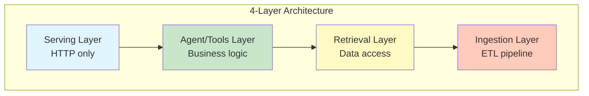
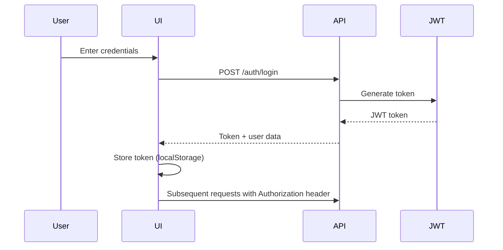

# Hướng dẫn Thiết kế

## Tổng quan

Document này cung cấp guidelines cho thiết kế hệ thống K.I.R.A Simplified, bao gồm:
- System design principles
- API design patterns
- Database design principles
- UI/UX guidelines
- Component design patterns

## System Design Principles

### 1. SOLID Principles

#### Single Responsibility Principle (SRP)

Mỗi module/class chỉ có một lý do để thay đổi:

```python
# ✅ GOOD: Tách biệt classification và execution
class CompositeClassifier:
    """Chỉ chịu trách nhiệm classification"""
    async def classify(self, query: str, user_id: str) -> ClassificationResult:
        ...

class RAGHandler:
    """Chỉ chịu trách nhiệm execution"""
    async def handle(self, query, user_id, classification) -> HandlerResult:
        ...

# ❌ BAD: Mixed responsibilities
class OldRouter:
    async def can_handle(self, query):  # Classification
        ...
    async def handle(self, query):      # Execution
        ...
```

#### Dependency Inversion Principle (DIP)

High-level modules phụ thuộc vào abstractions (ABCs), không phải concretions:

```python
# ✅ GOOD: Dependency on ABC
from src.interfaces.handlers import QueryHandlerBase

class Orchestrator:
    def __init__(self, handler: QueryHandlerBase):  # ABC dependency
        self.handler = handler

# ❌ BAD: Dependency on concretion
from src.handlers.rag import RAGHandler

class Orchestrator:
    def __init__(self, handler: RAGHandler):  # Concrete dependency
        self.handler = handler
```

### 2. Layer Separation



**Rules:**
- Serving Layer KHÔNG chứa business logic
- Agent/Tools Layer KHÔNG trực tiếp query database
- Retrieval Layer KHÔNG chứa HTTP concerns
- Ingestion Layer độc lập, chạy asynchronously

### 3. Protocol-Based Design (ABC)

Định nghĩa interfaces trong `src/interfaces/`:

```python
# src/interfaces/handlers.py
from abc import ABC, abstractmethod

class QueryHandlerBase(ABC):
    """ABC cho query handlers"""

    @abstractmethod
    async def handle(self, query, user_id, classification) -> HandlerResult:
        """Execute query logic"""
        pass

    @abstractmethod
    def can_handle(self, classification: ClassificationResult) -> bool:
        """Check if handler can handle this intent"""
        pass
```

**Benefits:**
- Compile-time type checking
- Easy mocking in tests
- Clear contract between modules
- Support multiple implementations

### 4. Async-First Pattern

Tất cả I/O operations phải async:

```python
# ✅ GOOD: Async I/O
async def fetch_documents(user_id: str) -> list[Document]:
    return await db.execute(select(Document).where(Document.user_id == user_id))

# ❌ BAD: Sync I/O (blocks event loop)
def fetch_documents(user_id: str) -> list[Document]:
    return db.execute(select(Document).where(Document.user_id == user_id))
```

### 5. Per-User Isolation

Tất cả dữ liệu phải được scoped by `user_id`:

```python
# ✅ GOOD: User-scoped operations
async def get_user_documents(user_id: str) -> list[Document]:
    return await qdrant_store.search(query, filter={"user_id": user_id})

# ❌ BAD: Cross-user access
async def get_all_documents() -> list[Document]:
    return await qdrant_store.search(query)  # Returns all users' data!
```

## API Design Patterns

### 1. RESTful Conventions

```
GET    /api/v1/documents          # List documents
POST   /api/v1/documents          # Upload document
GET    /api/v1/documents/{id}     # Get document detail
DELETE /api/v1/documents/{id}     # Delete document
```

### 2. Response Format

**Success Response:**
```json
{
  "data": { ... },
  "metadata": {
    "timestamp": "2024-01-01T00:00:00Z",
    "request_id": "uuid"
  }
}
```

**Error Response:**
```json
{
  "error": {
    "code": "VALIDATION_ERROR",
    "message": "Invalid input",
    "details": { ... }
  }
}
```

### 3. SSE Streaming Format

Chat streaming yields structured chunks:

```python
# Routing decision
yield {"type": "routing", "data": {"router": "RAGRouter", "intent": "rag"}}

# Retrieval progress
yield {"type": "retrieval", "data": {"docs_retrieved": 5}}

# Content chunks
yield {"type": "content", "data": {"text": "Response chunk..."}}

# Final metadata
yield {"type": "metadata", "data": {"citations": [...], "conversation_id": "..."}}

# Done signal
yield {"type": "done"}
```

### 4. Authentication

**JWT Token Format:**
```json
{
  "header": {
    "alg": "HS256",
    "typ": "JWT"
  },
  "payload": {
    "user_id": "uuid",
    "exp": 1234567890
  }
}
```

**Usage:**
```python
# Bearer token in Authorization header
Authorization: Bearer <JWT_TOKEN>

# FastAPI dependency
from src.api.dependencies import get_current_user

@router.post("/chat/stream")
async def chat_stream(current_user: User = Depends(get_current_user)):
    ...
```

## Database Design Principles

### 1. PostgreSQL Schema

**Key Models:**
```python
# User
User(id, email, hashed_password, created_at, updated_at)

# Document
Document(id, user_id, filename, status, metadata, created_at, updated_at)

# Conversation (soft delete)
Conversation(id, user_id, title, deleted_at, created_at, updated_at)

# Message
Message(id, conversation_id, role, content, citations, created_at)
```

**Soft Delete Pattern:**
```python
# ✅ GOOD: Soft delete with deleted_at
conversations = await db.execute(
    select(Conversation)
    .where(Conversation.user_id == user_id)
    .where(Conversation.deleted_at.is_(None))  # Exclude deleted
)

# ❌ BAD: Hard delete (cannot recover)
await db.execute(delete(Conversation).where(Conversation.id == id))
```

### 2. Qdrant Collection Structure

**Point Structure:**
```python
{
    "id": "uuid",
    "vector": [0.1, 0.2, ...],  # Embedding
    "payload": {
        "user_id": "uuid",
        "document_id": "uuid",
        "chunk_index": 0,
        "text": "Chunk content...",
        "metadata": { ... }
    }
}
```

**Indexing:**
```python
# Payload index for filtering
qdrant.create_payload_index(
    collection_name="documents",
    field_name="user_id",
    field_schema="keyword"
)
```

### 3. BM25 Index Structure

**Per-User Index:**
```python
# src/ingestion/bm25_builder.py
class BM25Builder:
    def __init__(self):
        self.indexes: dict[str, BM25] = {}  # user_id -> BM25 index

    async def add_chunks(self, user_id: str, chunks: list[Chunk]):
        if user_id not in self.indexes:
            self.indexes[user_id] = BM25()
        self.indexes[user_id].add_documents([c.text for c in chunks])
```

## UI/UX Guidelines

### 1. Component Design (Frontend)

**Component Structure:**
```
components/
├── auth/          # Auth-specific components
├── common/        # Shared components (Button, Modal, etc.)
├── documents/     # Document-related components
├── chat/          # Chat interface components
└── sidebar/       # Navigation components
```

**Naming Conventions:**
```typescript
// ✅ GOOD: Descriptive, kebab-case
DocumentUpload.tsx
ChatMessageList.tsx
CitationPanel.tsx

// ❌ BAD: Vague or non-kebab
Doc.tsx
MsgList.tsx
Cite.tsx
```

### 2. State Management (Zustand)

**Store Pattern:**
```typescript
// stores/chat-store.ts
interface ChatStore {
  // State
  messages: Message[]
  isStreaming: boolean

  // Actions
  addMessage: (message: Message) => void
  clearMessages: () => void
}

export const useChatStore = create<ChatStore>((set) => ({
  messages: [],
  isStreaming: false,
  addMessage: (message) => set((state) => ({
    messages: [...state.messages, message]
  })),
  clearMessages: () => set({ messages: [] })
}))
```

**Rules:**
- Keep stores small and focused
- Use TypeScript for type safety
- Separate concerns (chat, documents, auth)

### 3. API Integration (TanStack Query)

**Query Pattern:**
```typescript
// hooks/use-documents.ts
const useDocuments = () => {
  return useQuery({
    queryKey: ['documents'],
    queryFn: () => api.documents.list()
  })
}

// Mutation with optimistic update
const useUploadDocument = () => {
  const queryClient = useQueryClient()

  return useMutation({
    mutationFn: (file: File) => api.documents.upload(file),
    onSuccess: () => {
      queryClient.invalidateQueries({ queryKey: ['documents'] })
    }
  })
}
```

### 4. Error Handling

**Error Boundary:**
```typescript
// components/common/error-boundary.tsx
class ErrorBoundary extends React.Component {
  componentDidCatch(error, errorInfo) {
    console.error('Error:', error, errorInfo)
  }

  render() {
    if (this.state.hasError) {
      return <ErrorMessage />
    }
    return this.props.children
  }
}
```

**API Error Display:**
```typescript
// Show user-friendly error messages
const { error } = useDocuments()
if (error) {
  return <ErrorAlert message="Không thể tải tài liệu. Vui lòng thử lại." />
}
```

### 5. Loading States

**Skeleton Pattern:**
```typescript
// Show skeleton while loading
const { data, isLoading } = useDocuments()

if (isLoading) {
  return <DocumentListSkeleton />
}

return <DocumentList documents={data} />
```

**Streaming Indicator:**
```typescript
// Show typing indicator during streaming
{isStreaming && <TypingIndicator />}
```

## Security Design

### 1. Authentication Flow



### 2. Per-User Data Isolation

**Database Level:**
```python
# Always filter by user_id
documents = await db.execute(
    select(Document)
    .where(Document.user_id == current_user.id)  # Mandatory filter
)

# Use Row-Level Security (RLS) in production
```

**Application Level:**
```python
# Validate user access to resource
async def get_document(document_id: str, current_user: User):
    document = await db.get(Document, document_id)

    if document.user_id != current_user.id:
        raise HTTPException(status_code=403, detail="Access denied")

    return document
```

### 3. Input Validation

```python
# Pydantic validation
class ChatRequest(BaseModel):
    query: str = Field(min_length=1, max_length=2000)
    conversation_id: UUID | None = None

# Custom validation
@field_validator('query')
def validate_query(cls, v):
    if not v.strip():
        raise ValueError('Query cannot be empty')
    return v
```

## Performance Design

### 1. Caching Strategy

**LLM Classification Cache:**
```python
# src/classification/strategies/cached.py
class CachedStrategy(ClassificationStrategyBase):
    def __init__(self, base_strategy: ClassificationStrategyBase):
        self.base_strategy = base_strategy
        self.cache = LRUCache(maxsize=1000)  # Cache 1000 classifications

    async def classify(self, query: str, user_id: str) -> ClassificationResult:
        cache_key = hash((query, user_id))

        if cached := self.cache.get(cache_key):
            return cached

        result = await self.base_strategy.classify(query, user_id)
        self.cache.put(cache_key, result)
        return result
```

**Cache Rules:**
- Cache LLM classifications (expensive ~800ms)
- Do NOT cache retrieval results (data changes frequently)
- Use TTL for user-specific data

### 2. Parallel Processing

**Hybrid Retrieval:**
```python
# Execute in parallel for speed
async def search(query: str, user_id: str):
    dense_results, bm25_results = await asyncio.gather(
        dense_retrieval.search(query, user_id),
        bm25_retrieval.search(query, user_id)
    )

    return rrf_fusion(dense_results, bm25_results)
```

### 3. Streaming Responses

**SSE Streaming:**
```python
async def handle_stream(query, user_id, classification):
    # Yield chunks as they arrive
    async for chunk in llm_client.generate(query, context):
        yield {"type": "content", "data": {"text": chunk}}

    # Final metadata
    yield {"type": "metadata", "data": {"citations": [...], "done": True}}
```

## Testing Design

### 1. Unit Tests

```python
# Test classification strategies
@pytest.mark.asyncio
async def test_keyword_strategy():
    strategy = KeywordStrategy()
    result = await strategy.classify("contract.pdf", "user123")

    assert result.intent == Intent.RAG
    assert result.confidence > 0.8
```

### 2. Integration Tests

```python
# Test API endpoints
@pytest.mark.asyncio
async def test_chat_stream(client, auth_token):
    response = await client.post(
        "/api/v1/chat/stream",
        json={"query": "test"},
        headers={"Authorization": f"Bearer {auth_token}"}
    )

    assert response.status_code == 200
```

### 3. E2E Tests

```typescript
// Test full chat flow
test('complete chat flow', async ({ page }) => {
  await page.goto('/chat')
  await page.fill('[data-testid="chat-input"]', 'Hello')
  await page.click('[data-testid="send-button"]')

  await expect(page.locator('[data-testid="chat-message"]')).toBeVisible()
})
```

## Design Patterns Summary

| Pattern | Usage | Location |
|---------|-------|----------|
| Strategy | Pluggable classification | `src/classification/strategies/` |
| Adapter | Legacy router support | `src/handlers/adapters/` |
| Factory | Handler creation | `src/di/container.py` |
| Repository | Data access abstraction | `src/indexing/` |
| Builder | Complex object construction | `src/ingestion/pipelines.py` |
| Observer | SSE streaming | `src/api/routes/chat.py` |

## Related Documentation

- [Kiến trúc Hệ thống](./system-architecture.md) - Detailed architecture
- [Tiêu chuẩn Code](./code-standards.md) - Code conventions
- [Tóm tắt Codebase](./codebase-summary.md) - Codebase overview
- [CLAUDE.md](../CLAUDE.md) - Development guidelines
