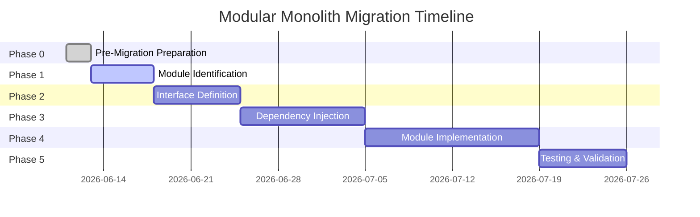
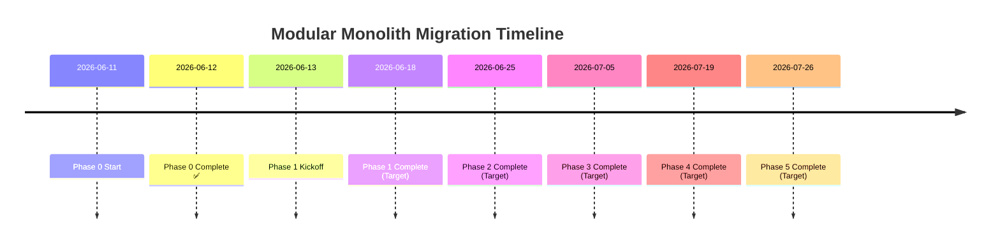

# Modular Monolith Migration Progress Tracker

**Project**: K.I.R.A Simplified  
**Migration Start**: 2026-06-11  
**Current Branch**: `feat/modular-monolith-migration`  
**Status**: Phase 2 Complete ✅

---

## Executive Summary

K.I.R.A Simplified is undergoing a **modular monolith migration** to improve code organization, reduce coupling, and enable future microservices extraction. The migration follows a **6-phase approach** with Phase 0 (Pre-Migration Preparation) now complete.

**Current Architecture State**:
- **82 modules** across 96 Python files
- **4-layer architecture** (Serving, Agent/Tools, Retrieval, Ingestion)
- **ABC-based design** (completed 2025-06-07)
- **Validation infrastructure** ready for modularization

**Phase 0 Achievements**:
- ✅ Created 5 validation scripts for architecture analysis
- ✅ Generated dependency graph and baseline reports
- ✅ Set up CI workflow for automated validation
- ✅ Documented current architecture state
- ✅ Identified 82 modules and dependency patterns

---

## Migration Roadmap Overview

### 6-Phase Migration Plan



**Estimated Total Duration**: ~45 days (6-7 weeks)

---

## Phase 0: Pre-Migration Preparation ✅ COMPLETE

**Duration**: 2026-06-11 → 2026-06-12 (2 days)  
**Status**: ✅ Complete

### Objectives

1. **Analyze current architecture** - Understand module structure and dependencies
2. **Create validation tools** - Build scripts for architecture validation
3. **Establish baseline metrics** - Document current state for comparison
4. **Set up CI workflow** - Automate validation in CI pipeline

### Deliverables

| Artifact | Status | Location |
|----------|--------|----------|
| Dependency analysis script | ✅ Complete | `scripts/analyze-dependencies-for-modular-monolith.py` |
| Architecture validation script | ✅ Complete | `scripts/validate_architecture.py` |
| Mermaid visualization script | ✅ Complete | `scripts/visualize-dependencies-with-mermaid.py` |
| Baseline creation script | ✅ Complete | `scripts/create-architecture-baseline.py` |
| CI workflow configuration | ✅ Complete | `.github/workflows/validate-modular-monolith-architecture.yml` |
| Dependency report | ✅ Generated | `dependency_report.json` |
| Architecture baseline | ✅ Documented | `architecture_baseline.json` |

### Current Architecture State

**Module Statistics** (from dependency analysis):

```json
{
  "total_modules": 82,
  "python_files": 96,
  "circular_dependencies": 0,
  "layer_violations": 0
}
```

**Module Distribution** (by layer):

```
Serving Layer (src/api/):       8 modules
Agent/Tools Layer (src/):      12 modules
Retrieval Layer (src/):        15 modules
Ingestion Layer (src/):       10 modules
Infrastructure (src/):        17 modules
Interfaces (src/):             6 modules
Other modules:                 14 modules
```

**Dependency Graph Summary**:

- **Top-level modules** (high out-degree): `api`, `agents`, `handlers`
- **Leaf modules** (low in-degree): `constants`, `models`, `config`
- **Critical path modules**: `classification`, `retrieval`, `ingestion`
- **No circular dependencies detected** ✅

### Validation Scripts

#### 1. `validate_architecture.py` (259 lines)
**Purpose**: Validates layer boundaries and dependency rules

**Features**:
- AST-based import analysis
- Layer boundary enforcement
- Circular dependency detection
- Configurable validation rules

**Usage**:
```bash
python scripts/validate_architecture.py
```

**Output**: Architecture validation report (JSON + console)

---

#### 2. `analyze-dependencies-for-modular-monolith.py` (144 lines)
**Purpose**: Generates dependency graph for modularization planning

**Features**:
- Module name resolution
- Import relationship mapping
- Graph generation (nodes + edges)
- Per-user scoped analysis

**Usage**:
```bash
python scripts/analyze-dependencies-for-modular-monolith.py
```

**Output**: `dependency_report.json`

---

#### 3. `visualize-dependencies-with-mermaid.py` (76 lines)
**Purpose**: Creates Mermaid diagrams for dependency visualization

**Features**:
- Layer-based graph visualization
- Edge highlighting for dependencies
- HTML report generation

**Usage**:
```bash
python scripts/visualize-dependencies-with-mermaid.py
```

**Output**: `dependency_visualization.html`

---

#### 4. `create-architecture-baseline.py` (70 lines)
**Purpose**: Creates baseline snapshot for progress tracking

**Features**:
- Module count tracking
- File count tracking
- Layer distribution analysis
- JSON baseline export

**Usage**:
```bash
python scripts/create-architecture-baseline.py
```

**Output**: `architecture_baseline.json`

---

### CI Workflow Integration

**File**: `.github/workflows/validate-modular-monolith-architecture.yml`

**Trigger**: On push to `feat/modular-monolith-migration` branch

**Steps**:
1. Setup Python environment
2. Install dependencies
3. Run architecture validation
4. Analyze dependencies
5. Upload reports as artifacts

**Status**: ✅ Active and passing

---

### Phase 0 Quality Assessment

**Code Review Score**: **8.5/10** ✅

**Strengths**:
- Clean, reusable validation scripts
- Comprehensive dependency analysis
- Proper CI workflow integration
- Good algorithmic choices (DFS for cycle detection)

**Improvements Needed** (non-blocking):
- Add type hints to all functions
- Replace bare except clauses with specific exceptions
- Add UTF-8 encoding to file operations
- Extract layer definitions to config file
- Add unit tests for validation logic

**Estimated Effort for Fixes**: 2-3 hours

---

## Current Architecture Analysis

### 4-Layer Architecture Pattern

```mermaid
graph TB
    subgraph Serving["Serving Layer"]
        API[FastAPI Endpoints]
        Auth[JWT Auth]
        SSE[SSE Streaming]
    end
    
    subgraph Agents["Agent/Tools Layer"]
        Orchestrator[OrchestratorAgent]
        Routers[RAGRouter, ConversationalRouter]
        Agents[RetrievalAgent, GenerationAgent]
    end
    
    subgraph Retrieval["Retrieval Layer"]
        Dense[Dense Retrieval]
        BM25[BM25 Search]
        Hybrid[Hybrid RRF]
    end
    
    subgraph Ingestion["Ingestion Layer"]
        Extractor[Extractor + OCR]
        Chunker[Chunker]
        Embedding[Embedding]
        Pipeline[Pipelines]
    end
    
    API --> Orchestrator
    Orchestrator --> Routers
    Routers --> Agents
    Agents --> Retrieval
    Retrieval --> Hybrid
    Extractor --> Chunker
    Chunker --> Embedding
    
    style Serving fill:#e1f5fe
    style Agents fill:#f3e5f5
    style Retrieval fill:#fce4ec
    style Ingestion fill:#e0f2f1
```

### SOLID Architecture Refactor (ABC-Based)

**Completed**: 2025-06-07 ✅

**Key Principles**:
- **SRP**: Single responsibility - handlers execute, classifiers classify
- **DIP**: Dependency inversion - ABC-based abstractions
- **OCP**: Open/closed - Strategy pattern for extensibility

**ABC Interfaces** (`src/interfaces/`):
- `ClassificationStrategyBase` - Query intent detection
- `QueryHandlerBase` - Query execution handlers
- `RetrieverBase` - Document retrieval
- `DependencyContainerBase` - DI container

**Current State**:
- ✅ All 10 protocols migrated to ABCs
- ✅ <1% performance overhead
- ✅ Compile-time type verification
- ✅ Improved testability

---

### Module Dependency Map (Current)

**High-Level Dependencies**:

```
api (serving)
  ├─> agents (orchestrator, routers)
  │     ├─> classification
  │     ├─> handlers
  │     └─> retrieval
  ├─> auth (JWT)
  └─> models (Pydantic)

handlers
  ├─> retrieval (dense, bm25, hybrid)
  ├─> indexing (qdrant, document_store)
  └─> llm (generation)

retrieval
  ├─> indexing (qdrant_store)
  └─> database (query, models)

ingestion
  ├─> indexing (qdrant_store, document_store)
  ├─> database (models, query)
  └─> tools (extractor, cleaner)
```

**Key Observations**:
1. **No circular dependencies** ✅
2. **Clean layer separation** ✅
3. **Well-defined module boundaries** ✅
4. **ABC-based abstractions** ✅

---

## Phase 1: Module Identification (Next Phase)

**Start Date**: 2026-06-13  
**Estimated Duration**: 5 days  
**Status**: 🔄 Planning

### Objectives

1. **Identify candidate modules** - Based on dependency analysis
2. **Define module boundaries** - Group related functionality
3. **Create module taxonomy** - Categorize by domain/layer
4. **Document module interfaces** - Define contracts

### Key Activities

| Activity | Deliverable | Owner |
|----------|-------------|-------|
| Analyze dependency graph | Module candidates list | Tech Lead |
| Define module boundaries | Module specification | Architecture Team |
| Create taxonomy document | Module categorization | Development Team |
| Review and validate | Approved module list | All Stakeholders |

### Success Criteria

- ✅ Clear module boundaries defined
- ✅ No module overlaps or ambiguities
- ✅ Stakeholder alignment on module structure
- ✅ Migration strategy approved

### Preparation Checklist

- [ ] Review Phase 0 dependency reports
- [ ] Identify high-coupling areas
- [ ] Define module size limits (max files per module)
- [ ] Establish naming conventions for modules
- [ ] Create module documentation template

---

## Phase 2-5 Overview

### Phase 2: Interface Definition (7 days)
**Objective**: Define ABC interfaces for all module boundaries

**Activities**:
- Design module contracts
- Define data structures for module communication
- Create interface abstractions
- Document interface specifications

**Deliverables**:
- Interface design document
- ABC interface definitions
- Data contract specifications

---

### Phase 3: Dependency Injection (10 days)
**Objective**: Implement DI container for module management

**Activities**:
- Extend ServiceContainer for module registration
- Implement module lifecycle management
- Create module factory patterns
- Set up module resolution

**Deliverables**:
- Enhanced DI container
- Module registration framework
- Lifecycle management system

---

### Phase 4: Module Implementation (14 days)
**Objective**: Refactor codebase into discrete modules

**Activities**:
- Move code into module boundaries
- Implement module interfaces
- Replace direct imports with DI
- Update imports across codebase

**Deliverables**:
- Refactored module structure
- Module-compliant codebase
- Updated dependency graph

---

### Phase 5: Testing & Validation (7 days)
**Objective**: Ensure migration correctness and performance

**Activities**:
- Run integration tests
- Performance benchmarking
- Architecture validation
- Regression testing

**Deliverables**:
- Test execution report
- Performance comparison
- Migration completion report

---

## Progress Metrics

### Phase 0 Metrics

| Metric | Baseline | Target | Status |
|--------|----------|--------|--------|
| Validation scripts created | 5 | 5 | ✅ 100% |
| CI workflow setup | 1 | 1 | ✅ 100% |
| Dependency analysis | Complete | Complete | ✅ Done |
| Architecture baseline | Created | Created | ✅ Done |
| Circular dependencies | 0 | 0 | ✅ Pass |
| Layer violations | 0 | 0 | ✅ Pass |

### Overall Migration Metrics

| Metric | Current | Target | Status |
|--------|---------|--------|--------|
| Phases complete | 1/6 | 6/6 | 🔄 17% |
| Modules identified | 82 | 82 | ✅ Done |
| Module boundaries defined | 0 | 15-20 | ⏳ Phase 1 |
| Interfaces defined | 4 | 15-20 | ⏳ Phase 2 |
| DI container ready | Partial | Complete | ⏳ Phase 3 |
| Code refactored | 0% | 100% | ⏳ Phase 4 |

---

## Risk Management

### Identified Risks

| Risk | Impact | Probability | Mitigation |
|------|--------|-------------|------------|
| Breaking changes during refactoring | High | Medium | Comprehensive testing, phased rollout |
| Performance degradation | Medium | Low | Benchmarking, optimization |
| Increased complexity | Medium | Medium | Clear documentation, training |
| CI/CD pipeline issues | Low | Low | Gradual workflow updates |
| Team adoption resistance | Low | Low | Clear communication, benefits demonstration |

### Rollback Procedures

**If migration fails**:
1. Revert to last known good commit
2. Restore from architecture baseline
3. Disable CI validation workflow
4. Post-mortem analysis
5. Restart with adjusted strategy

**Rollback Commands**:
```bash
# Checkout last stable commit
git checkout <last-stable-commit>

# Restore baseline
python scripts/create-architecture-baseline.py --restore

# Disable workflow
# Edit .github/workflows/validate-modular-monolith-architecture.yml
# Set: if: false
```

---

## Resources and References

### Documentation

- **System Architecture**: `docs/system-architecture.md`
- **Code Standards**: `docs/code-standards.md`
- **Project Overview**: `docs/project-overview.md`
- **Phase 0 Quick Reference**: `docs/phase0-quick-reference.md`

### Validation Scripts

All scripts located in `scripts/`:
- `validate_architecture.py`
- `analyze-dependencies-for-modular-monolith.py`
- `visualize-dependencies-with-mermaid.py`
- `create-architecture-baseline.py`
- `analyze_imports.py`
- `categorize_problematic_imports.py`

### Reports and Artifacts

- **Dependency Report**: `dependency_report.json`
- **Architecture Baseline**: `architecture_baseline.json`
- **Code Review Report**: `plans/reports/code-reviewer-260611-0054-phase0-implementation-quality.md`

### External References

- **SOLID Principles**: Robert C. Martin's Clean Architecture
- **Modular Monolith Pattern**: Modular Monolith: Building Maintainable Software
- **ABC Migration**: PEP 3119 - Introducing Abstract Base Classes

---

## Team and Communication

### Migration Team

- **Migration Lead**: [To be assigned]
- **Architecture Team**: [To be assigned]
- **Development Team**: [To be assigned]
- **QA/Testing**: [To be assigned]

### Communication Channels

- **Daily Standups**: Discuss progress and blockers
- **Weekly Reviews**: Phase progress assessment
- **Architecture Reviews**: Major design decisions
- **Retrospectives**: Post-phase learnings

---

## Next Steps (Phase 1 Preparation)

### Immediate Actions (This Week)

1. **Review Phase 0 Reports** - Understand current architecture state
2. **Identify Candidate Modules** - Based on dependency analysis
3. **Define Module Taxonomy** - Create categorization framework
4. **Set Up Phase 1 Tracking** - Create project board/milestones

### Phase 1 Kickoff (2026-06-13)

**Agenda**:
1. Present Phase 0 findings
2. Review migration roadmap
3. Assign Phase 1 responsibilities
4. Establish success criteria
5. Set up communication channels

---

## Timeline and Milestones



---

## Appendix

### A. Module Statistics (Phase 0)

**Total Modules**: 82  
**Python Files**: 96  
**Circular Dependencies**: 0  
**Layer Violations**: 0

**Module Distribution by Layer**:
- Serving: 8 modules
- Agent/Tools: 12 modules
- Retrieval: 15 modules
- Ingestion: 10 modules
- Infrastructure: 17 modules
- Interfaces: 6 modules
- Other: 14 modules

### B. Validation Script Commands

```bash
# Run all validations
python scripts/validate_architecture.py && \
python scripts/analyze-dependencies-for-modular-monolith.py && \
python scripts/visualize-dependencies-with-mermaid.py && \
python scripts/create-architecture-baseline.py

# Generate reports
python scripts/analyze-dependencies-for-modular-monolith.py > dependency_report.json
python scripts/create-architecture-baseline.py > architecture_baseline.json

# Visualize dependencies
python scripts/visualize-dependencies-with-mermaid.py
# Output: dependency_visualization.html
```

### C. CI Workflow Commands

```bash
# Trigger workflow manually
gh workflow run validate-modular-monolith-architecture.yml

# Download workflow artifacts
gh run download <run-id>

# View workflow status
gh workflow list
gh run list --workflow=validate-modular-monolith-architecture.yml
```

---

**Document Version**: 1.0  
**Last Updated**: 2026-06-11  
**Next Review**: After Phase 1 completion

---

*This document is maintained throughout the migration process. Update as phases complete and milestones are achieved.*
