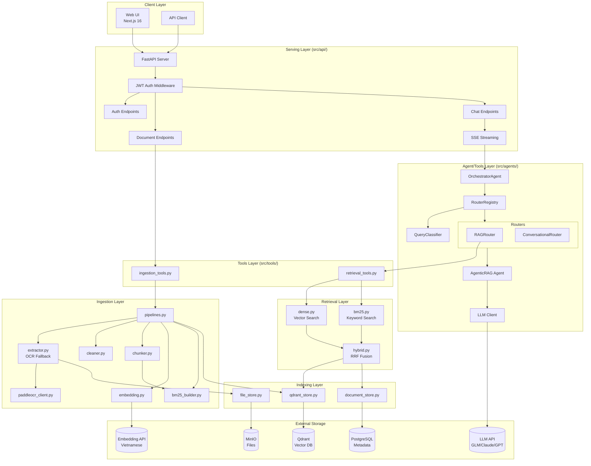
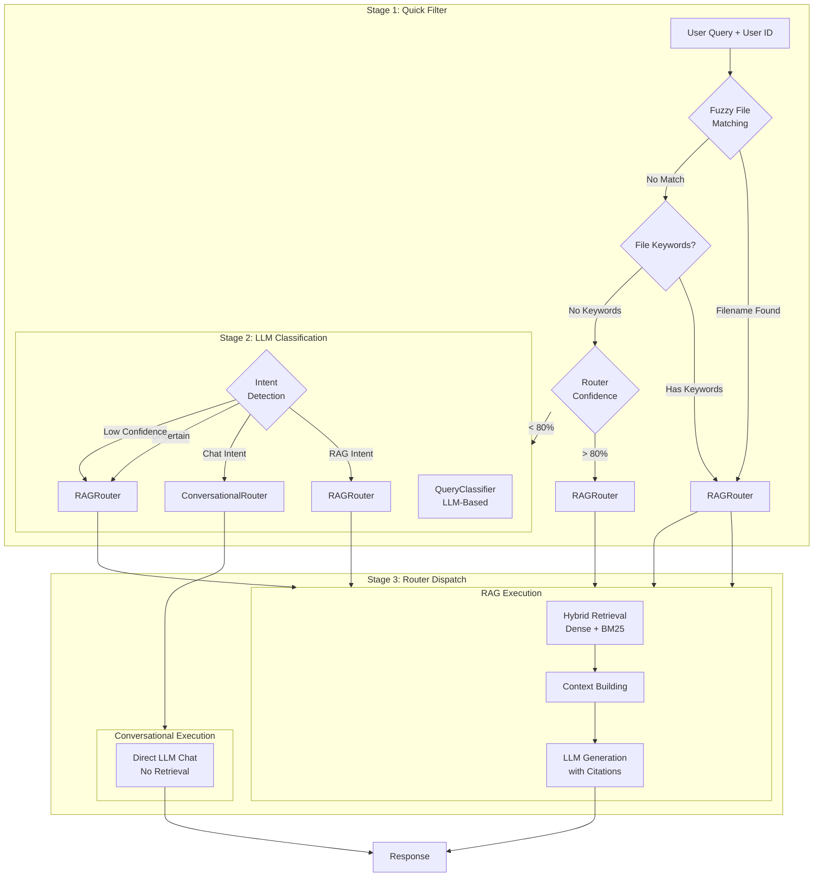

# Kiến trúc Hệ thống

## Tổng quan Architecture

K.I.R.A Simplified theo **4-layer architecture pattern** với tách biệt rõ ràng giữa các lớp:

## Các thành phần chính

### 1. Multi-Agent Routing

**Stages:**
1. **Quick Filter**: Fuzzy filename matching + keyword detection
2. **LLM Classification**: Intent detection (RAG vs Conversational)
3. **Router Dispatch**: Route to appropriate handler

### 2. Hybrid Retrieval (RRF)

- **Dense**: Vector similarity search via Qdrant
- **BM25**: Keyword search per-user index
- **RRF**: Reciprocal Rank Fusion for result merging

### 3. Intelligent OCR Fallback

- PyMuPDF native text extraction
- Low-quality detection → PaddleOCR fallback
- 2D layout sorting for reading order

## Luồng dữ liệu

### Query Processing Flow
1. User query → FastAPI `/chat/stream`
2. Orchestrator: Quick Filter → LLM Classification → Router Dispatch
3. RAGRouter: Hybrid Retrieval (Dense + BM25)
4. Context Building + LLM Generation
5. SSE Streaming response

### Document Ingestion Flow
1. User upload → MinIO storage
2. Background pipeline: Extract → Clean → Chunk → Embed → Index
3. Store vectors (Qdrant) + metadata (PostgreSQL) + BM25 index

## Infrastructure

### Services (Docker Compose)
- **PostgreSQL 16** + pgvector: Metadata storage
- **Qdrant**: Vector database
- **MinIO**: Object storage for files

### External APIs
- **LLM**: GLM-4.5 (primary), Claude, GPT (fallback)
- **Embedding**: Vietnamese embedding API
- **OCR**: PaddleOCR service (optional)

## Per-User Isolation

Tất cả dữ liệu được scoped by `user_id`:
- BM25 indexes
- Documents và chunks
- Conversations và messages
- API access control
