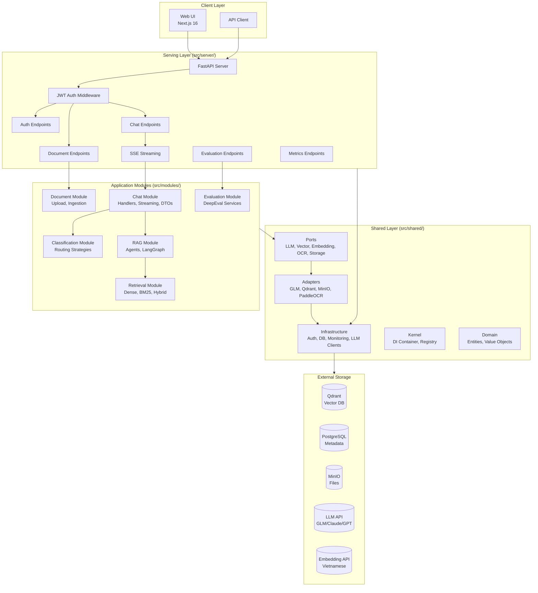
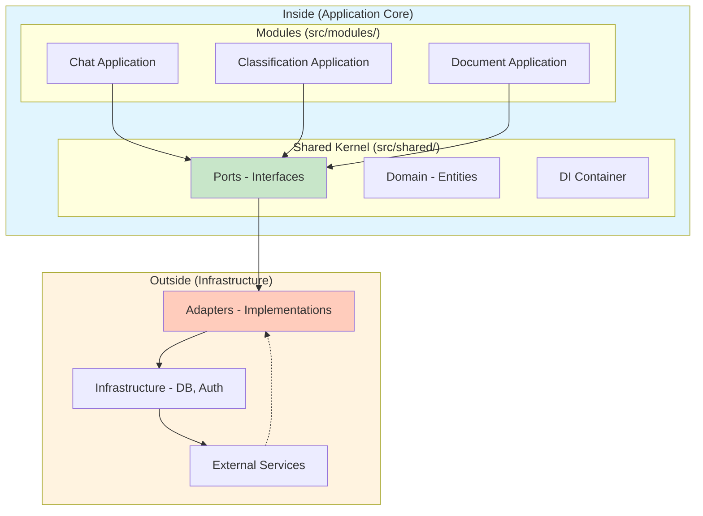

# Kiến trúc Hệ thống

## Tổng quan Architecture

KIRA theo **Hexagonal Modular Monolith Architecture** với tách biệt rõ ràng giữa các lớp:



## Module Structure

## Dependency Boundaries

The system is a modular monolith: modules communicate through application
services and ports, not through each other's infrastructure implementations.

```text
Chat API/handler
    -> RAG application service (RAGExecutionResult)
    -> RAG workflow port
    -> LangGraph workflow adapter

RAG workflow
    -> Retrieval application service
    -> retrieval ports
    -> Qdrant / BM25 / PostgreSQL adapters
```

The LangGraph state is internal to the RAG module. Chat code must not inspect
agent state or run relevance checks. Likewise, retrieval application code must
not import Postgres repositories or the BM25 manager directly; those are wired
in the retrieval composition root. Both streaming and non-streaming RAG calls
execute the same compiled graph, including the quality-gate regeneration edge.

```text
src/
├── server/                   # Serving Layer - HTTP endpoints only
│   ├── main.py              # FastAPI app entrypoint
│   └── api/v1/              # Server-owned API v1 endpoints
│       ├── auth/            # Authentication endpoints
│       ├── evaluation/      # DeepEval evaluation endpoints
│       └── metrics/         # Routing metrics endpoints
├── modules/                 # Application Modules - Business logic
│   ├── chat/                # Chat API, use cases, handlers, streaming
│   ├── classification/      # Query routing strategies
│   ├── document/            # Document API, upload, ingestion
│   ├── evaluation/          # DeepEval evaluation services
│   ├── rag/                 # Agentic RAG, LangGraph
│   └── retrieval/           # Dense, BM25, hybrid search
├── shared/                  # Shared Layer - Cross-cutting concerns
│   ├── ports/               # External system contracts
│   ├── adapters/            # External system implementations
│   ├── infrastructure/      # Auth, DB, monitoring, logging
│   ├── kernel/              # DI container, registry
│   ├── domain/              # Shared entities, value objects
│   └── utils/               # Utility functions
├── config/                  # Configuration management
│   ├── config.py           # Pydantic settings
│   └── settings.yaml       # Static configuration
└── constants/               # Application constants
```

## Hexagonal Architecture Pattern



**Key Principles:**
- **Inside** (Application Core): Business logic, domain rules, use cases
- **Outside** (Infrastructure): External services, DB, APIs
- **Ports**: Interfaces defined by Inside, implemented by Outside
- **Adapters**: Concrete implementations of Ports

## Module Breakdown

### 1. Chat Module (src/modules/chat/)

```text
src/modules/chat/
├── api/                    # Request/Response DTOs
│   ├── requests.py
│   └── responses.py
├── application/            # Use cases
│   ├── chat.py            # Chat use case
│   ├── dto.py             # Application DTOs
│   └── streaming.py       # SSE streaming logic
├── domain/                # Domain services
│   ├── services/         # Chat domain services
│   └── rag.py            # RAG domain service
└── infrastructure/        # External integrations
    └── handlers/         # Chat handlers
        ├── conversational.py
        └── rag_handler.py
```

**Responsibilities:**
- Chat use case orchestration
- Query classification integration
- Handler selection and execution
- SSE streaming response formatting
- Conversation and message persistence

### 2. Classification Module (src/modules/classification/)

```text
src/modules/classification/
├── api/                    # Classification DTOs
├── application/            # Classification use cases
└── domain/                # Classification strategies
    ├── cache/            # LRU cache
    └── strategies/       # Strategy implementations
        ├── cached.py    # Cached strategy
        ├── composite.py  # Composite classifier
        ├── keyword.py    # Keyword matching
        └── llm.py       # LLM-based classification
```

**Responsibilities:**
- Query intent classification (RAG vs Conversational)
- Strategy pattern for pluggable classifiers
- LRU caching for performance
- Fallback chain: Keyword → Cached → LLM

### 3. Document Module (src/modules/document/)

```text
src/modules/document/
├── api/                    # Document DTOs
├── application/            # Document use cases
│   ├── delete.py          # Delete use case
│   ├── upload.py          # Upload use case
│   └── ingestion.py      # Ingestion orchestration
└── domain/                # Document domain services
    └── infrastructure/    # Document-specific persistence
```

**Responsibilities:**
- Document upload and validation
- Background ingestion pipeline
- Text extraction and cleaning
- Document status management
- Document deletion (soft delete)

### 4. Retrieval Module (src/modules/retrieval/)

```text
src/modules/retrieval/
├── api/                    # Retrieval DTOs
├── application/            # Retrieval use cases
├── domain/                # Retrieval strategies
│   └── services/         # Retrieval services
└── infrastructure/        # Retrieval repositories
    ├── dense.py          # Vector search
    ├── bm25.py           # Keyword search
    └── hybrid.py         # RRF fusion
```

**Responsibilities:**
- Dense vector retrieval (Qdrant)
- BM25 keyword retrieval
- Hybrid search with RRF fusion
- Per-user result filtering
- Citation generation

### 5. RAG Module (src/modules/rag/)

```text
src/modules/rag/
├── application/            # RAG use cases
├── domain/                # RAG agents and state
│   ├── agents/           # LangGraph agents
│   ├── prompts/          # RAG prompts
│   └── state.py         # RAG state management
└── infrastructure/        # RAG infrastructure
```

**Responsibilities:**
- Agentic RAG with LangGraph
- Multi-agent orchestration
- Thinking visualization
- Citation verification
- Context building

### 6. Evaluation Module (src/modules/evaluation/)

```text
src/modules/evaluation/
├── api/                    # Evaluation DTOs
├── application/            # Evaluation use cases
└── domain/                # Evaluation services
    ├── dataset.py        # Golden dataset model/helpers
    ├── models.py         # Evaluation domain models
    └── service.py        # Evaluation service
```

**Responsibilities:**
- DeepEval-based RAG evaluation
- Golden dataset management
- Batch evaluation
- Evaluation caching
- Metrics tracking (faithfulness, relevancy, precision, recall)

## Shared Layer

### Ports (src/shared/ports/)

External system interfaces defined by application core:

```text
src/shared/ports/
├── llm.py                 # LLM client interface
├── vector_store.py       # Vector store interface
├── embedding.py          # Embedding service interface
├── ocr.py                # OCR service interface
└── storage.py            # Storage interface
```

### Adapters (src/shared/adapters/)

Concrete implementations of ports:

```text
src/shared/adapters/
├── llm/                  # LLM implementations
│   ├── glm.py           # Zhipu AI GLM
│   ├── gemini.py        # Google Gemini
│   └── openai.py        # OpenAI GPT
├── vector/               # Vector store implementations
│   └── qdrant.py        # Qdrant client
├── embedding/            # Embedding implementations
│   └── api_client.py    # Embedding API client
├── ocr/                  # OCR implementations
│   └── paddleocr.py     # PaddleOCR client
└── storage/              # Storage implementations
    └── minio.py         # MinIO client
```

### Infrastructure (src/shared/infrastructure/)

Cross-cutting technical concerns:

```text
src/shared/infrastructure/
├── auth/                 # Authentication infrastructure
│   └── jwt.py           # JWT token management
├── llm/                  # LLM client infrastructure
│   └── client.py       # Base LLM client
├── monitoring/           # Monitoring and logging
├── persistence/          # Database persistence
│   └── database/
│       ├── session.py   # DB session management
│       └── models.py    # SQLAlchemy models
└── logging/             # Logging configuration
```

### Kernel (src/shared/kernel/)

Dependency injection and service registry:

```text
src/shared/kernel/
├── base/                 # Base interfaces
├── di/                   # Dependency injection
│   ├── container.py    # Service container
│   └── registry.py      # Service registry
└── utils/               # Kernel utilities
```

## Data Flows

### Query Processing Flow

```text
POST /api/v1/chat/stream
  ↓
Server Layer (src/server/api/v1/chat/)
  ↓
Chat Module (src/modules/chat/application/chat.py)
  ↓
Classification Module (src/modules/classification/)
  - CompositeClassifier tries strategies
  - Keyword → Cached → LLM
  - Returns ClassificationResult (intent + confidence)
  ↓
Handler Selection (via DI Container)
  - RAGHandler for RAG intent
  - ConversationalHandler for chat intent
  ↓
Handler Execution
  ↓
Retrieval Module (if RAG)
  - Hybrid retrieval (Dense + BM25)
  - RRF fusion
  ↓
RAG Module (if RAG)
  - Context building
  - LLM generation
  - Citation extraction
  ↓
SSE Streaming Response
  - routing chunk
  - retrieval chunk
  - thinking chunk (if enabled)
  - content chunks
  - citations chunk
  - done signal
  ↓
Persistence
  - Save user message
  - Save assistant message
```

### Document Ingestion Flow

```text
POST /api/v1/documents/upload
  ↓
Module API Layer (src/modules/document/api/endpoints.py)
  ↓
Document Module (src/modules/document/application/upload.py)
  - Validate file
  - Upload to MinIO
  - Create document row in PostgreSQL
  ↓
Background Ingestion Task
  ↓
Document Module (src/modules/document/application/ingestion.py)
  ↓
Extraction
  - PyMuPDF native extraction
  - PaddleOCR fallback if needed
  ↓
Cleaning
  - Remove excess whitespace
  - Preserve Vietnamese diacritics
  ↓
Chunking
  - Token-based chunking (2048 tokens)
  - Overlap (256 tokens)
  ↓
Embedding
  - Call embedding API
  - Generate 1024-dim vectors
  ↓
Indexing
  - Qdrant upsert (vectors + metadata)
  - BM25 index update (per-user)
  ↓
Status Update
  - Update document status in PostgreSQL
```

### Retrieval Flow

```text
Query + User ID
  ↓
Embedding API
  - Generate query vector (1024-dim)
  ↓
Parallel Retrieval
  ├─→ Dense Retrieval (Qdrant)
  │   - Vector similarity search
  │   - Filter by user_id
  │   - Return top-k results
  │
  └─→ BM25 Retrieval
      - Keyword search
      - Per-user index
      - Return top-k results
  ↓
RRF Fusion
  - Combine results from both retrievers
  - Score-based merging
  - Return top-k fused results
  ↓
Reranking (Optional)
  - LLM-based reranking
  - Filter low-score results
  ↓
Citation Generation
  - Extract relevant snippets
  - Verify citation grounding
  - Return final citations
```

## Infrastructure

### Services (Docker Compose)

```text
PostgreSQL 16 + pgvector
  - Port: 5433
  - Database: kira_dev
  - Extensions: pgvector

Qdrant
  - HTTP Port: 6333
  - gRPC Port: 6334
  - Collection: document_chunks
  - Vector Dim: 1024

MinIO
  - API Port: 9000
  - Console Port: 9001
  - Bucket: kira-docs
```

### External APIs

```text
LLM Providers:
  - GLM-4.5 (Zhipu AI) - Primary
  - Gemini (Google) - Backup
  - GPT-4 (OpenAI) - Backup

Embedding:
  - Vietnamese embedding API
  - Dimension: 1024

OCR:
  - PaddleOCR (optional)
  - Vietnamese language support
```

## Configuration

### Runtime Settings (src/config/config.py)

Environment-based configuration via Pydantic Settings:

```text
JWT_SECRET_KEY (required)
APP_ENV (development/production)
POSTGRES_* (database connection)
QDRANT_* (vector store connection)
MINIO_* (object storage)
LLM_PROVIDER, GLM_API_KEY (LLM configuration)
EMBEDDING_BASE_URL, EMBEDDING_MODEL (embedding service)
```

### Static Settings (src/config/settings.yaml)

```text
embedding:
  dim: 1024
  base_url: "http://localhost:8001"

retrieval:
  k: 5
  rrf_k: 60
  min_score_threshold: 0.65

reranking:
  enabled: true
  mode: "llm"
  top_k_before: 20
  top_k_after: 5

citations:
  max_citations: 10
  min_score_threshold: 0.3
  snippet_length: 200

citation_verification:
  enabled: true
  grounding_threshold: 0.7

chunking:
  size: 2048
  overlap: 256

semantic_routing:
  enabled: true
  threshold: 0.75

feature_flags:
  use_new_classification: false
  use_new_handlers: false
  enable_semantic_router: true
  enable_llmlite_provider: false

evaluation:
  threshold: 0.7
  report_dir: reports/evaluation
```

## Per-User Isolation

All data is scoped by `user_id`:

```text
BM25 Indexes:
  - One index per user
  - Key: user_id

Documents & Chunks:
  - Qdrant payload filter: user_id
  - PostgreSQL WHERE clause: user_id

Conversations & Messages:
  - PostgreSQL WHERE clause: user_id
  - Soft delete with deleted_at

API Access Control:
  - JWT token contains user_id
  - All queries filtered by user_id
```

## Development vs Production

### Development Environment

```text
Backend:
  - Host: localhost
  - Port: 8006
  - Hot reload enabled
  - Debug mode: true

Frontend:
  - Host: localhost
  - Port: 3001
  - Next.js dev server
  - Fast refresh enabled

Infrastructure:
  - Docker Compose
  - Local volumes
  - Default credentials
```

### Production Environment

```text
Backend:
  - Gunicorn/Uvicorn
  - Multiple workers
  - Health checks enabled
  - Monitoring integrated

Frontend:
  - Static build (npm run build)
  - Nginx serving
  - CDN for assets

Infrastructure:
  - Managed PostgreSQL (RDS/CloudSQL)
  - Managed Qdrant (Cloud/Self-hosted)
  - Managed MinIO (Self-hosted/Cloud)
  - Redis for caching (optional)
```

## Key Design Decisions

### 1. Hexagonal Architecture

**Why:**
- Clear separation between business logic and infrastructure
- Easy to test (mock ports)
- Easy to swap implementations (change adapters)
- Domain-driven design friendly

**Trade-offs:**
- More initial boilerplate
- More layers to navigate
- Requires discipline to maintain boundaries

### 2. Modular Monolith

**Why:**
- Simple deployment (single artifact)
- Shared database (ACID transactions)
- Easy development (run locally)
- Clear module boundaries

**Trade-offs:**
- Coupled deployments
- Shared scaling
- Module boundary enforcement requires discipline

### 3. Strategy Pattern for Classification

**Why:**
- Pluggable classifiers
- Easy to add new strategies
- Fallback chain for reliability
- Cache-friendly design

**Trade-offs:**
- More classes to maintain
- Strategy selection logic complexity

### 4. SSE Streaming

**Why:**
- Real-time user experience
- Progressive response rendering
- Better perceived performance
- Claude-style thinking visualization

**Trade-offs:**
- More complex frontend handling
- Connection management
- Harder to test

### 5. Per-User BM25 Indexes

**Why:**
- User data isolation
- Better relevance (user-specific corpus)
- Simple access control
- Easy deletion (per-user cleanup)

**Trade-offs:**
- Memory overhead (many indexes)
- Rebuild on document upload
- Not suitable for cross-user search

## Related Documentation

- [CLAUDE.md](../CLAUDE.md) - Development guidelines for AI assistants
- [README.md](../README.md) - Project overview and setup
- [deployment-guide.md](./deployment-guide.md) - Deployment instructions
- [project-overview.md](./project-overview.md) - Runtime and project overview
- [code-standards.md](./code-standards.md) - Code conventions

---

*Last Updated: 2026-06-12*
*Architecture: Hexagonal Modular Monolith*
*Python: 3.12 | Next.js: 16 | React: 19*
