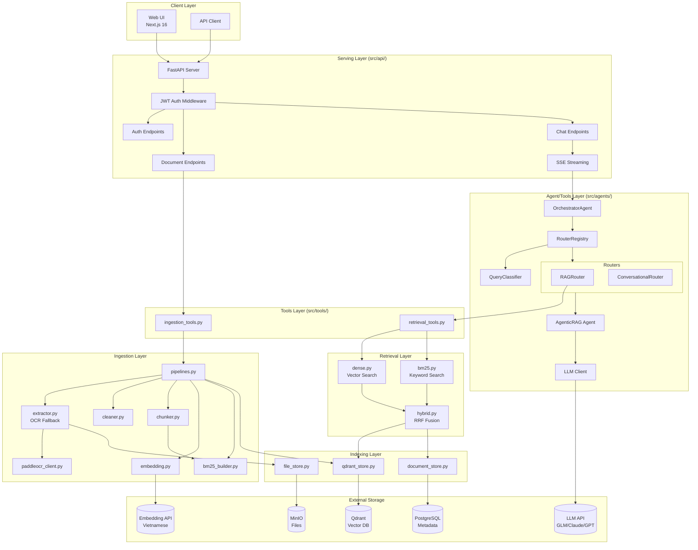
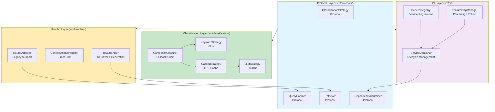
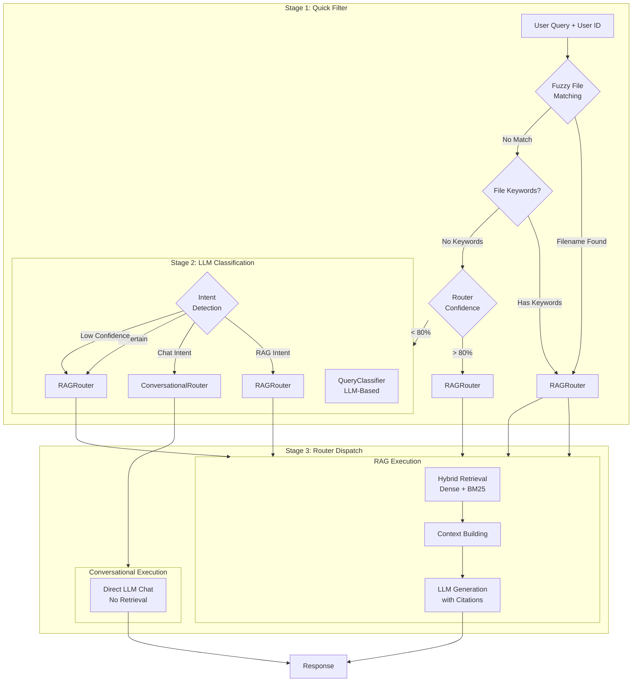

# Kiến trúc Hệ thống

## Tổng quan Architecture

K.I.R.A Simplified theo **4-layer architecture pattern** với tách biệt rõ ràng giữa các lớp, và đã được refactor theo **SOLID principles** với protocol-based design:

## Các thành phần chính

### 1. SOLID Protocol-Based Architecture (Refactor mới)

**Protocol Benefits**:
- **DIP**: High-level modules depend on protocols, not concretions
- **OCP**: Open for extension (new implementations), closed for modification
- **SRP**: Single responsibility - handlers execute, classifiers classify
- **Testability**: Protocol-based mocking in tests

### 2. Multi-Agent Routing (Legacy → Protocol Migration)

**Stages:**

1. **Quick Filter**: Fuzzy filename matching + keyword detection
2. **LLM Classification**: Intent detection (RAG vs Conversational)
3. **Router Dispatch**: Route to appropriate handler

**New Architecture (Protocol-based)**:

- Classification moved to `src/classification/` with Strategy pattern
- Handlers moved to `src/handlers/` with QueryHandler protocol
- RouterAdapter provides backward compatibility with old routers

### 3. Classification Chain (Strategy Pattern)

### 4. Hybrid Retrieval (RRF)

- **Dense**: Vector similarity search via Qdrant
- **BM25**: Keyword search per-user index
- **RRF**: Reciprocal Rank Fusion for result merging

### 5. Intelligent OCR Fallback

- PyMuPDF native text extraction
- Low-quality detection → PaddleOCR fallback
- 2D layout sorting for reading order

## Luồng dữ liệu

### Query Processing Flow (Legacy)

1. User query → FastAPI `/chat/stream`
2. Orchestrator: Quick Filter → LLM Classification → Router Dispatch
3. RAGRouter: Hybrid Retrieval (Dense + BM25)
4. Context Building + LLM Generation
5. SSE Streaming response

### Query Processing Flow (New Protocol-Based)

1. User query → FastAPI `/chat/stream`
2. **Classification**: CompositeClassifier tries strategies in order
   - KeywordStrategy → CachedStrategy → LLMStrategy
   - Returns ClassificationResult with intent + confidence
3. **Handler Selection**: ServiceContainer resolves appropriate handler
   - RAGHandler for RAG intent
   - ConversationalHandler for chat intent
4. **Execution**: Handler executes domain-specific logic
   - RAG: Hybrid Retrieval → Context Building → LLM Generation
   - Conversational: Direct LLM chat
5. **Response**: Handler returns HandlerResult or streams chunks

### Document Ingestion Flow

1. User upload → MinIO storage
2. Background pipeline: Extract → Clean → Chunk → Embed → Index
3. Store vectors (Qdrant) + metadata (PostgreSQL) + BM25 index

## Infrastructure

### Services (Docker Compose)

- **PostgreSQL 16** + pgvector: Metadata storage
- **Qdrant**: Vector database
- **MinIO**: Object storage for files

### External APIs

- **LLM**: GLM-4.5 (primary), Claude, GPT (fallback)
- **Embedding**: Vietnamese embedding API
- **OCR**: PaddleOCR service (optional)

## Per-User Isolation

Tất cả dữ liệu được scoped by `user_id`:

- BM25 indexes
- Documents và chunks
- Conversations và messages
- API access control

## Migration Notes

### Router → Handler Migration

The system is gradually migrating from router-based to protocol-based architecture:

**Old Pattern** (`src/agents/routers/`):
- Routers handle both classification and execution
- Inherit from `BaseRouter`
- Registered in `RouterRegistry`

**New Pattern** (`src/handlers/`, `src/classification/`):
- Classification separate from execution (SRP)
- Implement `QueryHandler` and `ClassificationStrategy` protocols
- Registered in `ServiceContainer` (DI)

**Backward Compatibility**: `RouterAdapter` in `src/handlers/adapters/` allows old routers to work with new protocol-based system.

See [CLAUDE.md](../CLAUDE.md) for detailed migration guide.
