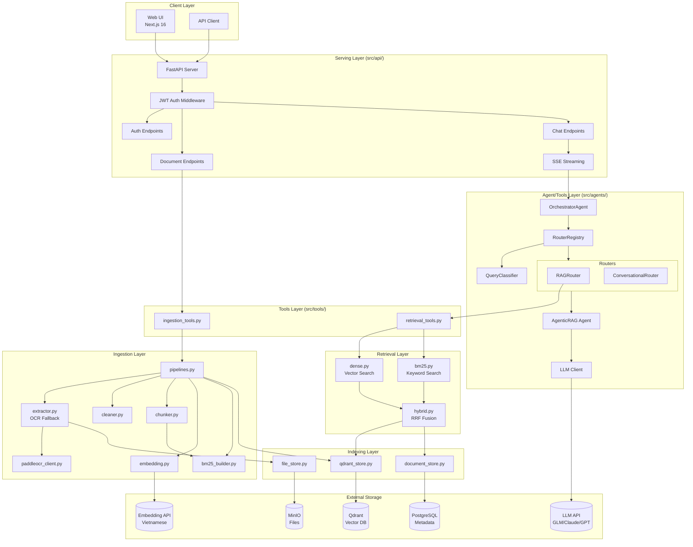
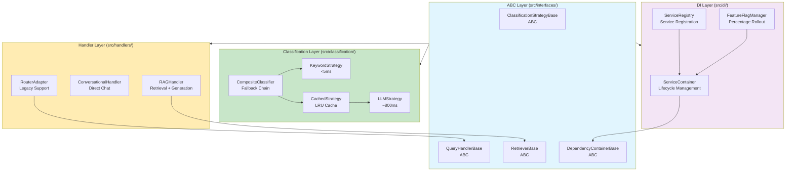
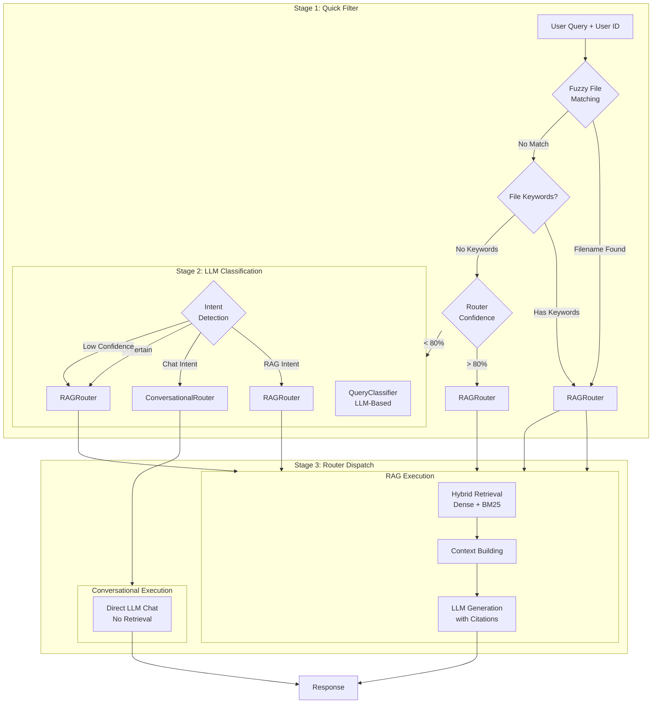
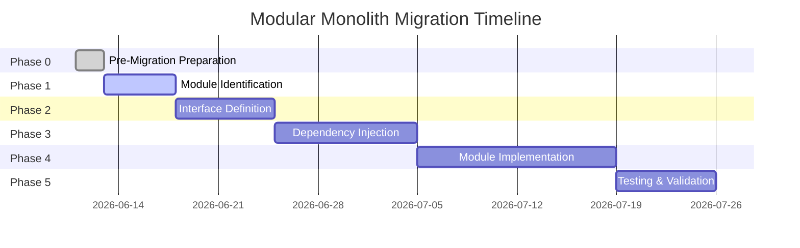

# Kiến trúc Hệ thống

## Tổng quan Architecture

K.I.R.A Simplified theo **4-layer architecture pattern** với tách biệt rõ ràng giữa các lớp, và đã được refactor theo **SOLID principles** với ABC-based design (Protocol migration hoàn thành 2025-06-07):



## Các thành phần chính

### 1. SOLID ABC-Based Architecture (Refactor hoàn thành 2025-06-07)



**ABC Benefits**:
- **DIP**: High-level modules depend on ABC abstractions, not concretions
- **OCP**: Open for extension (new implementations), closed for modification
- **SRP**: Single responsibility - handlers execute, classifiers classify
- **Testability**: ABC-based mocking with compile-time verification
- **Performance**: <1% overhead compared to Protocol-based design (migration 2025-06-07)

### 2. Multi-Agent Routing (Legacy → ABC Migration)



**Stages:**

1. **Quick Filter**: Fuzzy filename matching + keyword detection
2. **LLM Classification**: Intent detection (RAG vs Conversational)
3. **Router Dispatch**: Route to appropriate handler

**New Architecture (Protocol-based)**:

- Classification moved to `src/classification/` with Strategy pattern
- Handlers moved to `src/handlers/` with QueryHandler protocol
- RouterAdapter provides backward compatibility with old routers

### 3. Classification Chain (Strategy Pattern)

### 4. Hybrid Retrieval (RRF)

- **Dense**: Vector similarity search via Qdrant
- **BM25**: Keyword search per-user index
- **RRF**: Reciprocal Rank Fusion for result merging

### 5. Intelligent OCR Fallback

- PyMuPDF native text extraction
- Low-quality detection → PaddleOCR fallback
- 2D layout sorting for reading order

## Luồng dữ liệu

### Query Processing Flow (Legacy)

1. User query → FastAPI `/chat/stream`
2. Orchestrator: Quick Filter → LLM Classification → Router Dispatch
3. RAGRouter: Hybrid Retrieval (Dense + BM25)
4. Context Building + LLM Generation
5. SSE Streaming response

### Query Processing Flow (New Protocol-Based)

1. User query → FastAPI `/chat/stream`
2. **Classification**: CompositeClassifier tries strategies in order
   - KeywordStrategy → CachedStrategy → LLMStrategy
   - Returns ClassificationResult with intent + confidence
3. **Handler Selection**: ServiceContainer resolves appropriate handler
   - RAGHandler for RAG intent
   - ConversationalHandler for chat intent
4. **Execution**: Handler executes domain-specific logic
   - RAG: Hybrid Retrieval → Context Building → LLM Generation
   - Conversational: Direct LLM chat
5. **Response**: Handler returns HandlerResult or streams chunks

### Document Ingestion Flow

1. User upload → MinIO storage
2. Background pipeline: Extract → Clean → Chunk → Embed → Index
3. Store vectors (Qdrant) + metadata (PostgreSQL) + BM25 index

## Infrastructure

### Services (Docker Compose)

- **PostgreSQL 16** + pgvector: Metadata storage
- **Qdrant**: Vector database
- **MinIO**: Object storage for files

### External APIs

- **LLM**: GLM-4.5 (primary), Claude, GPT (fallback)
- **Embedding**: Vietnamese embedding API
- **OCR**: PaddleOCR service (optional)

## Per-User Isolation

Tất cả dữ liệu được scoped by `user_id`:

- BM25 indexes
- Documents và chunks
- Conversations và messages
- API access control

## Migration Notes

### Router → Handler Migration

The system is gradually migrating from router-based to protocol-based architecture:

**Old Pattern** (`src/agents/routers/`):
- Routers handle both classification and execution
- Inherit from `BaseRouter`
- Registered in `RouterRegistry`

**New Pattern** (`src/handlers/`, `src/classification/`):
- Classification separate from execution (SRP)
- Implement `QueryHandler` and `ClassificationStrategy` protocols
- Registered in `ServiceContainer` (DI)

**Backward Compatibility**: `RouterAdapter` in `src/handlers/adapters/` allows old routers to work with new protocol-based system.

See [CLAUDE.md](../CLAUDE.md) for detailed migration guide.

---

## Modular Monolith Migration (2026)

### Phase 0: Pre-Migration Preparation ✅ COMPLETE

**Status**: Phase 0 completed 2026-06-11  
**Branch**: `feat/modular-monolith-migration`  
**Documentation**: [Migration Progress Tracker](modular-monolith-migration-progress.md) | [Phase 0 Quick Reference](phase0-quick-reference.md)

**Achievements**:
- ✅ Created 5 validation scripts for architecture analysis
- ✅ Generated dependency graph (82 modules, 96 files)
- ✅ Set up CI workflow for automated validation
- ✅ Documented current architecture state
- ✅ Verified: 0 circular dependencies, 0 layer violations

**Current Architecture State**:
```
Total Modules: 82
Python Files: 96
Circular Dependencies: 0
Layer Violations: 0

Module Distribution:
- Serving Layer (src/api/): 8 modules
- Agent/Tools Layer (src/): 12 modules
- Retrieval Layer (src/): 15 modules
- Ingestion Layer (src/): 10 modules
- Infrastructure (src/): 17 modules
- Interfaces (src/): 6 modules
- Other modules: 14 modules
```

**Migration Roadmap**:


**Validation Infrastructure**:
- **Architecture Validation**: `scripts/validate_architecture.py`
- **Dependency Analysis**: `scripts/analyze-dependencies-for-modular-monolith.py`
- **Visualization**: `scripts/visualize-dependencies-with-mermaid.py`
- **Baseline Creation**: `scripts/create-architecture-baseline.py`
- **CI Workflow**: `.github/workflows/validate-modular-monolith-architecture.yml`

**Next Steps (Phase 1)**:
- Identify candidate modules (15-20 target modules)
- Define module boundaries based on dependency analysis
- Create module taxonomy and categorization
- Document module interfaces

**Migration Status**: Phase 0 Complete ✅ → Phase 1 Planning

---

*Last Updated: 2026-06-11*  
*For detailed migration progress, see [docs/modular-monolith-migration-progress.md](modular-monolith-migration-progress.md)*
