# Báo Cáo Tổng Hợp Đánh Giá Hệ Thống RAG (RAG Evaluation Summary Report)

- **Mã đợt đánh giá (Batch ID):** `efaecdde-c4ff-4d20-bba6-9b446f2c86cd`
- **Thời gian thực hiện:** 30/06/2026 18:32:13 UTC (Duration: 730.85 giây)
- **Tổng số mẫu test:** 141 mẫu
- **Tình trạng:** Thành công 141/141 (Không có lỗi hệ thống phát sinh)

---

## 1. Kết Quả Tổng Quan (Aggregate Scores)

Dưới đây là điểm số trung bình của toàn bộ 141 mẫu test dựa trên 3 tiêu chí đánh giá cốt lõi (theo thang điểm từ 0.0 đến 1.0):

| Chỉ số đánh giá (Metric) | Điểm số (Score) | Mô tả chỉ số |
| :--- | :---: | :--- |
| **Answer Relevancy** (Độ liên quan câu trả lời) | **0.835** | Đo mức độ câu trả lời giải quyết trực tiếp và đầy đủ câu hỏi. |
| **Contextual Recall** (Độ phủ của ngữ cảnh) | **0.742** | Đo mức độ RAG truy xuất đầy đủ thông tin cần thiết từ tài liệu nguồn. |
| **Faithfulness** (Tính trung thực/Độ tin cậy) | **0.838** | Đo mức độ câu trả lời được chứng thực và không bị "ảo tưởng" (hallucinated) ngoài ngữ cảnh. |
| **Overall Score** (Điểm số chung) | **0.807** | Trung bình của 3 chỉ số trên. |
| **Pass Rate** (Tỉ lệ đạt yêu cầu) | **50.4%** | Tỉ lệ các mẫu có tất cả điểm số đạt ngưỡng quy định (84/141 mẫu đạt). |

---

## 2. Phân Tích Lỗi Đánh Giá (Failure Analysis)

Hệ thống ghi nhận **57 trường hợp thất bại** (không vượt qua ngưỡng chất lượng). Các lỗi này được phân loại như sau (lưu ý một mẫu có thể mắc nhiều hơn một lỗi):

| Phân loại lỗi | Số lượng mẫu | Tỉ lệ lỗi trên tổng mẫu | Mô tả nguyên nhân |
| :--- | :---: | :---: | :--- |
| **Retrieval Failures** | 0 | 0.0% | Top-k không tìm thấy bất kỳ tài liệu liên quan nào (Lỗi này không xuất hiện). |
| **Generation Answer** | 35 | 24.8% | Truy xuất ngữ cảnh đạt yêu cầu nhưng câu trả lời tạo ra bị lệch hướng, thiếu thông tin hoặc sai lệch so với ý hỏi. |
| **Generation Grounding** | 30 | 21.3% | Câu trả lời chứa các khẳng định không có căn cứ hoặc không khớp chính xác với thông tin trong ngữ cảnh truy xuất (bị ảo tưởng hoặc thêm bớt chi tiết). |

---

## 3. Hiệu Suất Theo Tài Liệu Nguồn (Performance by Document)

Phân tích hiệu suất RAG đối với từng tài liệu nguồn trong hệ thống để xác định tài liệu nào đang gây khó khăn nhất cho bộ thu hồi (Retrieval) hoặc bộ sinh câu trả lời (Generation):

| Tài liệu nguồn (Document) | Số mẫu | Tỉ lệ đạt (Pass Rate) | Điểm chung | Độ liên quan (Relevancy) | Độ phủ (Recall) | Độ tin cậy (Faithfulness) |
| :--- | :---: | :---: | :---: | :---: | :---: | :---: |
| [1144_2040_QĐ xét chọn Nhà giáo tiêu biểu](file:///home/nguyenhuynh/Documents/kira/reports/evaluation/rag-eval-20260630-183213.md#L48) | 12 | **100.0%** (12/12) | 1.000 | 1.000 | 1.000 | 1.000 |
| [1189_2140_QĐ công khai đường dây nóng](file:///home/nguyenhuynh/Documents/kira/reports/evaluation/rag-eval-20260630-183213.md#L126) | 11 | **100.0%** (11/11) | 0.970 | 0.977 | 0.977 | 0.962 |
| [2_Nghị định 59/2023/NĐ-CP Dân chủ cơ sở](file:///home/nguyenhuynh/Documents/kira/reports/evaluation/rag-eval-20260630-183213.md#L321) | 11 | **81.8%** (9/11) | 0.859 | 0.893 | 0.818 | 0.899 |
| [576_104_Kế hoạch thực hiện QĐ 1705](file:///home/nguyenhuynh/Documents/kira/reports/evaluation/rag-eval-20260630-183213.md#L230) | 4 | **75.0%** (3/4) | 0.906 | 0.792 | 1.000 | 1.000 |
| [104_245_HD khung bảo đảm CLGD](file:///home/nguyenhuynh/Documents/kira/reports/evaluation/rag-eval-20260630-183213.md#L178) | 27 | **63.0%** (17/27) | 0.852 | 0.938 | 0.815 | 0.835 |
| [16_Kế hoạch 1158/KH-BGDĐT Tuyên truyền](file:///home/nguyenhuynh/Documents/kira/reports/evaluation/rag-eval-20260630-183213.md#L139) | 15 | **60.0%** (9/15) | 0.850 | 0.887 | 0.867 | 0.852 |
| [1214_QĐ ban hành Quy định đào tạo ĐH](file:///home/nguyenhuynh/Documents/kira/reports/evaluation/rag-eval-20260630-183213.md#L412) | 9 | **44.4%** (4/9) | 0.751 | 0.867 | 0.667 | 0.793 |
| [1_Luật Thanh tra 2025](file:///home/nguyenhuynh/Documents/kira/reports/evaluation/rag-eval-20260630-183213.md#L282) | 16 | **43.8%** (7/16) | 0.762 | 0.741 | 0.750 | 0.856 |
| [20_CV 624/BGDĐT-TTr Thanh tra nội bộ](file:///home/nguyenhuynh/Documents/kira/reports/evaluation/rag-eval-20260630-183213.md#L360) | 10 | **30.0%** (3/10) | 0.679 | 0.672 | 0.550 | 0.923 |
| [5274_QĐ BH chiến lược phát triển Trường](file:///home/nguyenhuynh/Documents/kira/reports/evaluation/rag-eval-20260630-183213.md#L87) | 4 | **25.0%** (1/4) | 0.745 | 0.812 | 0.750 | 0.673 |
| [130_02/2025/TT-BGDĐT Khung năng lực số](file:///home/nguyenhuynh/Documents/kira/reports/evaluation/rag-eval-20260630-183213.md#L438) | 9 | **11.1%** (1/9) | 0.654 | 0.759 | 0.556 | 0.718 |
| [2023m10_QĐ ban hành VB pháp quy](file:///home/nguyenhuynh/Documents/kira/reports/evaluation/rag-eval-20260630-183213.md#L269) | 13 | **7.7%** (1/13) | 0.627 | 0.718 | 0.462 | 0.781 |

> [!WARNING]
> **Điểm nghẽn nghiêm trọng:** Các tài liệu pháp quy viết tắt dạng mã hóa phức tạp (`2023m10_100000000_9220027PBQPPL_CVD_Quy`, `130_02_TT_quy_dinh_khung_nang_luc_so_cho`, `5274_QD_BH_chien_luoc_phat_trien_Truong_`) có tỉ lệ đạt cực thấp (dưới 25%). Điều này cho thấy cấu trúc văn bản hoặc chất lượng chunking của nhóm tài liệu này chưa tối ưu.

---

## 4. Hiệu Suất Theo Loại Câu Hỏi (Performance by Question Type)

Hệ thống được đánh giá qua 6 nhóm câu hỏi khác nhau để kiểm tra toàn diện khả năng suy luận:

| Loại câu hỏi (Query Type) | Số lượng mẫu | Tỉ lệ đạt (Pass Rate) | Điểm số chung | Đánh giá độ khó |
| :--- | :---: | :---: | :---: | :--- |
| **Fact** (Thông tin thực tế) | 57 | **68.4%** (39/57) | 0.871 | Dễ nhất (Hệ thống trả lời khá chính xác) |
| **Responsibility** (Trách nhiệm đơn vị) | 16 | **62.5%** (10/16) | 0.835 | Trung bình khá |
| **Condition** (Điều kiện áp dụng) | 23 | **52.2%** (12/23) | 0.794 | Trung bình |
| **Procedure** (Quy trình thực hiện) | 21 | **38.1%** (8/21) | 0.774 | Khó |
| **Summary** (Tóm tắt nội dung) | 13 | **30.8%** (4/13) | 0.697 | Rất khó |
| **Definition** (Định nghĩa khái niệm) | 11 | **27.3%** (3/11) | 0.670 | Khó nhất |

---

## 5. Biểu Đồ Phân Bố Điểm Số (Score Distribution)

Phân tích số lượng mẫu tương ứng với từng khoảng điểm chất lượng (`overall_score`):

```mermaid
gantt
    title Phân bố Điểm số (Score Distribution) - 141 mẫu
    dateFormat  X
    axisFormat %s
    section Điểm Tuyệt đối (1.0)
    64 mẫu : 0, 64
    section Điểm Khá (0.8 - 0.99)
    31 mẫu : 0, 31
    section Điểm Trung bình (0.6 - 0.79)
    21 mẫu : 0, 21
    section Điểm Yếu (0.4 - 0.59)
    19 mẫu : 0, 19
    section Điểm Kém (0.0 - 0.39)
    6 mẫu  : 0, 6
```

- **Nhận xét:** Khoảng 67.3% số câu hỏi (95/141) đạt điểm khá tốt trở lên (>= 0.80). Tuy lượng mẫu nằm ở khoảng điểm trung bình và yếu vẫn còn khá cao (46 mẫu dưới 0.80), kéo tỉ lệ Pass Rate chung xuống chỉ còn **50.4%**.

---

## 6. Khuyến Nghị và Giải Pháp Cải Tiến (Actionable Recommendations)

Để nâng cao chất lượng hệ thống RAG lên trên mức mục tiêu 85% Pass Rate, nhóm phát triển cần tập trung vào các hành động cụ thể sau:

### 💡 Cải tiến khâu Truy xuất (Retrieval)
1. **Khắc phục lỗi cho câu hỏi định nghĩa (Definition) và tóm tắt (Summary):**
   - Điểm recall đối với hai loại câu hỏi này chỉ đạt khoảng **0.556**, phản ánh việc bộ tìm kiếm (Hybrid Search / Dense Vector) không tìm thấy đúng chunk chứa định nghĩa gốc.
   - *Giải pháp:* Tăng kích thước chunk (Chunk Size) từ mặc định lên lớn hơn đối với các văn bản pháp quy dài, hoặc triển khai cơ chế **Parent-Child Chunking** / **Sentence Window Retrieval** để giữ lại ngữ cảnh định nghĩa đầy đủ.
2. **Xử lý tài liệu định danh phức tạp:**
   - Các tài liệu có tỉ lệ đạt cực thấp như `2023m10_100000000_9220027PBQPPL_CVD_Quy` cần được kiểm tra lại khâu trích xuất (Extraction). Khả năng cao do các bảng biểu (table) hoặc sơ đồ trong văn bản này bị trích xuất lỗi dạng văn bản thô (raw text), làm mất đi tính liên kết thông tin.

### ✍️ Cải tiến khâu Sinh câu trả lời (Generation)
1. **Giảm thiểu lỗi ảo tưởng thông tin (Faithfulness - 30 lỗi):**
   - Bộ sinh (LLM) thường tự động thêm bớt các chi tiết "hợp lý" (ví dụ: gán nhầm vai trò từ Chủ tịch trường sang các Đơn vị phòng ban, tự suy luận thêm điều khoản pháp lý).
   - *Giải pháp:* Siết chặt System Prompt của `GenerationAgent`, yêu cầu LLM **chỉ trả lời dựa trên ngữ cảnh được cung cấp**, nếu có bất kỳ thông tin nào ngoài ngữ cảnh thì tuyệt đối không được tự suy diễn hoặc ghi rõ là không tìm thấy trong văn bản.
2. **Tối ưu hóa câu trả lời thiếu (Generation Answer - 35 lỗi):**
   - LLM thỉnh thoảng bỏ sót các ý quan trọng trong câu hỏi phức tạp (câu hỏi có 2 vế như "tên đầy đủ là gì và ban hành ngày nào").
   - *Giải pháp:* Sử dụng prompt chia nhỏ câu hỏi phức tạp trước khi sinh (Chain of Thought), hoặc cấu trúc câu trả lời của RAG dưới dạng bullet points để đảm bảo trả lời hết tất cả các khĩ cạnh của câu hỏi.
